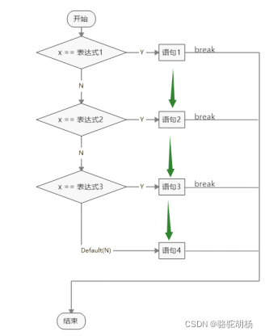
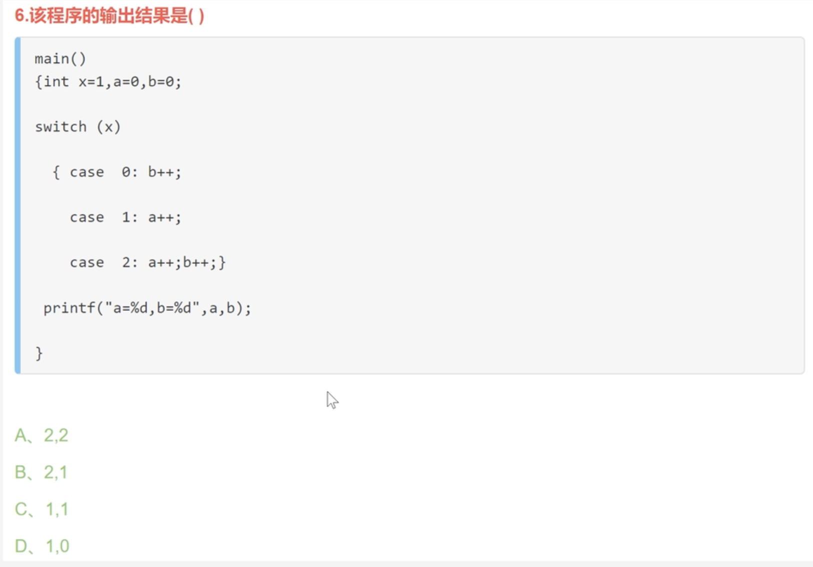
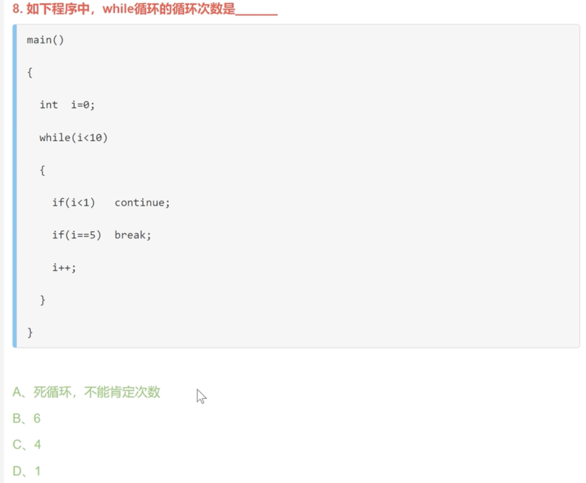
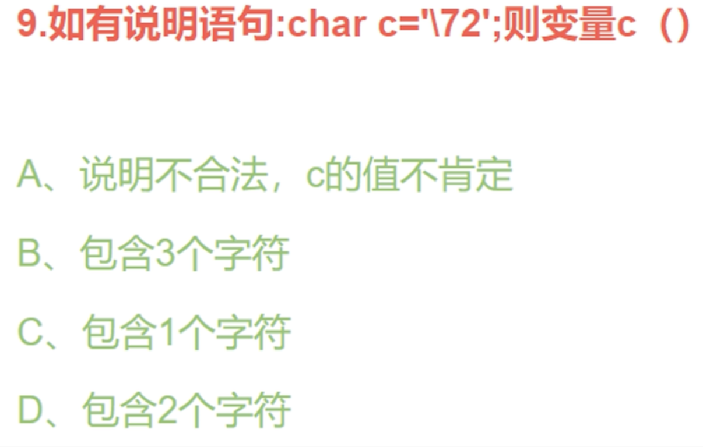

# Makefiles
## Basic notations
- **Shell Script:**
Shell Script，Shell脚本与Windows/Dos下的批处理相似，也就是用各类命令预先放入到一个文件中，方便一次性执行的一个程序文件，主要是方便管理员进行设置或者管理用的。但是它比Windows下的批处理更强大，比用其他编程程序编辑的程序效率更高，它使用了Linux/Unix下的命令。

shell和shell脚本有什么区别？确切一点说，Shell就是一个命令行解释器，它的作用就是遵循一定的语法将输入的命令加以解释并传给系统。它为用户提供了一个向Linux发送请求以便运行程序的接口系统级程序，用户可以用Shell来启动、挂起、停止甚至是编写一些程序。 Shell本身是一个用C语言编写的程序，它是用户使用Linux的桥梁。Shell既是一种命令语言，又是一种程序设计语言(就是你所说的shell脚本)。作为命令语言，它互动式地解释和执行用户输入的命令；作为程序设计语言，它定义了各种变量和参数，并提供了许多在高阶语言中才具有的控制结构，包括循环和分支。它虽然不是 Linux系统内核的一部分，但它调用了系统内核的大部分功能来执行程序、创建文档并以并行的方式协调各个程序的运行。


## 第二章 数据类型、运算符和表达式
程序=数据结构+算法

### 2.1 保留字和标识符*
- 保留字（reserve word）:是C++预先定义的字符序列。编程者不能将它们用作自己的变量名或函数名等。
- 表识符（Identifier）:是有效字符序列，用来标识用户自己定义的变量名、符号常量名、函数名、数组名和类型名等。

### 2.2 C++的基本数据类型
描述一个数据需要两方面的信息：一是数据站用的存储空间的大小（即该数据占用的字节数）；二是该数据允许执行的操作或运算。
|类型标识符|名称|占用字节数|
|----------|---|-------|
|char|字符型|1|
|int|整型|4|
|float|实型|4|
|double|双精度实型|8|
|bool|逻辑型|1|
|void|空类型| |

### 2.3常量和变量

==底层理解上，我们希望知道这些常量和变量在内存中的存储形式，是否是ASCII码，二进制存储==
**常量：**
1. 整型常量
2. 逻辑型常量
3. 实型常量
4. 字符型常量：用单引号括起来的一个字符成为字符型常量
5. 字符串常量：字符串常量是用双引号括起来的字符序列
6. **符号常量**：用一个符号标识符代表一个常量。编程者可以在程序的开头定义一个符号常量，令其代表一个值，在后续程序中可使用该符号常量。
```
#define PRICE 30
#define PI 3.1415926
#define S "China"
```

**变量：**
```
int a,b;
unsigned u;
float f;
double d;
char c1,c2,c3

#变量赋初值
int a, b;
a = 12; b = 23;

int a=1, b=13;

# 常变量 (因为变量能够随时变化，常变量就是保护变量值，不允许对变量做修改)
const float pi=3.14;
```

### 2.4 基本运算符和表达式
在C++中，数据处理是通过运算来实现的。运算符又称为操作符。为表示一个计算过程。需要使用表达式，表达式是由运算符、运算量构成的一个计算序列（例：x+y）。不同种的运算符具有优先级呵结合性。运算符根据运算量的顺序，分为：一元运算符、二元运算符、三元运算符

**算术运算符和算术表达式：**
==对于/（除法运算），当两个运算量均为整型量时为整除，整除的意义是取除法结果的整数部分。当至少有一个运算量为实型量时则为通常意义的除法。==

==C++在给出关系表达式或逻辑表达式运算结果时，以数值1代表“真”，以数值0代表“假”。

**位运算符和位运算表达式：**
位运算是对整型量的运算，并且规定符号位参与运算，主要用于编写系统软件，完成汇编语言能够完成的一些功能，如对机器字以及机器字中的二进制位进行操作。

**自增、自减运算符和表达式：**
C++中有两个可以改变变量自身值的运算符，它们是自增（++）和自减（--）运算符，作用是使变量自身的值加1或减1。这两个运算符均是一元运算符，而且只能对变量做运算。它们可以放在变量之前或之后，如++i、--i表示先将i的值加1或减1，然后再参见其他运算；而i++、i--表示先用i的值参加运算，然后再将变量i的值加1或减1。

**赋值运算符和赋值表达式：**
逗号运算符的优先级在C++所有运算符中最低，从左到右进行运算。

**sizeof运算符和表达式：**
是一元运算符，作用是求一个变量或常量所占用的字节数

**逻辑运算优化的副作用：**
C++语言在计算逻辑表达式的值时，从左到右扫描表达式，表达式的值一旦确定后，就不再继续进行计算，这就是逻辑运算的优化。

### 2.5 类型转换
**赋值时的自动类型转换：**
1. 实给整：简单舍弃小数部分
2. 整给实：数值不变，有效位数增加
3. 整给整：较复杂，因为整型量有8种。

**各种类型运算量混合运算时的自动类型转换：**
==两个不同类型的量运算时，计算机内部首先将它们转换成相同数据类型的量，然后进行运算。见课本P21来获取更多的信息。==

**强制类型转换：**
```
i=int(x+y)
z=double(a)
```
==类型转换运算符的优先级较高，通常在表达式中，先执行类型转化运算符，再执行其他运算
类型强制转换的对象是表达式的值，表达式double(a)的意义是将a的值（即表达式的值）转换成double型，而变量a自身仍然是int型变量。==


- 在进行运算时会发生数据类型隐式转化，这里的规则是低精度数据转换成高精度数据。

## 第三章 简单的输入输出

在C语言中使用系统库函数，一般要包含相应的库函数文件，库函数文件总是被引用在程序文件的最前方，所以又叫（Head File)。用文件扩展名.h来表示。C语言中，使用scanf()和printf()可以在不包含任何头文件的情况下使用，而C++ complier则更为严格。在C++编译器中使用任何一个系统库函数，都需要包含相应的头文件。
C语言中是scanf和printf这两个函数来控制输入输出，但这两个函数可能比较复杂，C++中采用更先进的over-loading technique to control the information flow.

C++中，输入输出对象是在头文件iostream中定义的。因此要使用C++提供的输入输出流技术时，必须在程序的开头增加两行说明，如下：
```
#include <iostream>
using namespace std
```

```
cout << a <<","<<b<<endl
cout <<a<<"\t"<<b<<`\n`
```

endl表示要输出一个换行符，它是短语“end of line"，其在意义上等同于转义字符``\n``。'\t'横向制表符，跳到下一个Tab位置。

输入流对象cin是根据变量的数据类型来决定接收的数值的。因此，在使用输入流技术输入数据时，输入值的顺序和类型必须要与输入流语句中变量的顺序和类型一致。否则，就得不到正确的数值。在输入流中，回车符即是分隔符又是确认符。因此，在使用回车符是，要特别注意分辨回车符的作用，掌握回车符的正确使用方法。输出流对象cout不是根据变量的数据类型来决定输出的数据格式的，而是根据变量中具体的数据来决定输出格式。因此，实型变量小数部分为零时也可以输出整数格式的结果。使用setw()可以指定输出数据项的宽度。不过需要注意的是当数据项的实际宽度大指定宽度的时候，系统会按照实际宽度输出。
(1)
std::cout << "n" << std::setw(12) << std::endl;
(2)
using namespace std;
cout<< "n" << setw(12) << endl;

说明：
- setw()用来制定其后的输出项占用的字符宽度
	- setw()函数式定义在iomanip头文件中的系统函数。必须包含头文件`#include <iomanip>`
	- 详细的解释见课本P27
- std表明的是C++标准程序库被定义为一个名为std的namespace(命名空间)。我们这个cout就是这个命名空间里面的一个变量。
	- [C++之作用域运算符::](https://blog.csdn.net/gyymen/article/details/53534235?spm=1001.2101.3001.6661.1&utm_medium=distribute.pc_relevant_t0.none-task-blog-2%7Edefault%7ECTRLIST%7ERate-1-53534235-blog-100833833.pc_relevant_multi_platform_whitelistv3&depth_1-utm_source=distribute.pc_relevant_t0.none-task-blog-2%7Edefault%7ECTRLIST%7ERate-1-53534235-blog-100833833.pc_relevant_multi_platform_whitelistv3&utm_relevant_index=1)
	- [std::cout 与 cout 有什么区别](https://blog.csdn.net/wzhrsh/article/details/87873489)

==第二第三章我们了解了构成程序的基本语法要素，如常量、变量、表达式和输入输出函数等，但要实现算法，还需要学习程序设计语言的语句。==
## 第四章 C++的流程控制
计算机程序可以实现各种复杂的运算，这不是仅仅靠前面介绍的输入输出以及基本的数据操作就可以完成的。在程序中真正实现各种实际运算功能的是算法，学习计算机编程最重要的也是学习算法的设计方法。
本章首先介绍程序的算法及其效率、算法的设计原则、算法的表示工具；然后给出了结构化程序设计的3种基本控制结构，介绍了C++语言中实现这3种结构的流程控制语句；最后结合具体问题，给出了若干使用流程控制语句解决实际应用的程序实例。

### switch 语句
switch的基本使用
```c++
基本语法：
switch  (x) {
case  表达式1：
     语句1
     break;
case  表达式2：
     语句2
     break;
case  表达式3：
     语句3
     break;
default表达式1：
     语句1
     break;
}
```



- 如果没有break语句，会接着向下执行其他的break
- **switch和if的选择**
  - switch：只能用于等于比较, 用于**int/char/long/long long** 类型的变量，和多个特定常量的判断处理。
    **（float和double类型不可以）**
  - if: 适用于各种逻辑判断

例子：




### while循环



- 答案是A，死循环。因为continue的意思是重新执行循环，而下面的语句不进行执行了。

#### 

## 第五章 函数

### 5.2 函数的定义

**函数**：函数可以是系统预定义的，也可以是用户自定义的。前者称为系统函数或标准库函数，后者称为用户自定义函数。

**函数体**：一个函数体是用花括号括起来的语句序列。它描述了函数实现一个功能的过程，并要在最后执行一个函数返回。
（1）将流程从当前函数返回其上级（调用函数）
（2）撤销函数调用时为各参数及变量分配的内存空间
（3）向调用函数返回最多一个值

关于return语句的使用说明如下：
（1）有返回值的return语句，用它可以返回一个表达式的值，从而实现函数之间的信息传递。
（2）无返回值的函数需用void来定义函数的返回值类型，该函数中可以有return语句，也可以无return语句，当被调函数中无return语句时，程序执行完函数体的最后一条语句后返回调用函数，相当于函数体的右括号有返回功能。

**函数的原型声明**：在C++中，当函数定义在前，调用在后时，调用前可以不必声明；如果一个函数的定义在后，调用在前，则在调用前必须声明函数的原型。
- 函数原型声明，可以放在main()函数里面，也可以放在main()函数之前。
- `int main(int, int);` 也可以写成`int main(int x, int y);` 这是两个标准的函数调用模型

### 5.3 函数的调用

**函数的调用：**

1. 传值调用。就是传统常见的函数调用形式，分为实参和形参。
	1. 即使实参列表中没有参数，括号也不能省略。实参是用来在调用函数时给形参初始化的，一般要求在函数调用时实参的个数和类型必须与行参的个数和类型一致，即个数相等，类型相同。
2. 引用调用。如果想使形参的改变影响实参就不能使用传值调用，而应选用引用调用。引用是一种特殊类型的变量，可以认为是另一个变量的别名。
	```c++
	int i, &r=i;
	```
	
	```c++
	#include <iostream>
	using namespace std;
	
	void swap (int &x, int $y)
	{
	  int t;
	  t=x;x=y;y=t;
	  cout<<"x="<<x<<","<<"y="<<y<<endl;
	}
	
	int main ()
	{
	  int a(4),b(5); //int a=4, b=5
	  swap(a,b) //会改变a和b的值
	}
	```
	

### 5.9 程序的多文件组织

内部函数

```c++
static int fun(int x, int y)
```

- 使用内部函数，可以使函数只局限于所在文件，如果在不同的文件中有同名的内部函数，将互不干扰


外部函数

```c++
extern int fun(int x, int y)
```

- C++语言规定，在默认情况下，所有函数都是外部函数


## 第六章 编译预处理

### 6.1 宏定义

不带参数的宏定义

```c++
#define PI 3.1414926
```

- 有效范围：从定义开始处到包含它的源文件结束
- 可以用`#undef`命令终止宏定义的作用域
- 可以层层嵌套


带参数的宏定义

```c++
#define ADD(x,y) x+y
```

- 与函数调用区别：函数调用是在程序运行时处理的，分配临时的内存单元。而宏代换是在编译前进行的，在代换时不分配内存，不进行值的传递，也没有“返回值”的概念。


### 6.2 “文件包含处理”

`#include <文件名>`或`#include "文件名"`

- 在程序中若有`#include <math>`，则C++预处理器遇到这条命令后，就自动到该include目录中搜寻math.h，并把它嵌入当前文件中。这种搜寻方式称为标准方式。而`#include "文件名"`格式则首先在文件所在当前工作目录中进行搜寻；如果搜寻不到，再按标准方式进行搜寻，该方式适用于用户建立的头文件。


### 6.3 条件编译

利用条件编译可以使用一个源程序在不同的条件下产生不同的目标代码，用于完成不同的功能。常见的用处

1. 调试程序时增加一下调试语句，以达到跟踪的目的
2. 某一种系统编写的程序若要移植到另一个系统中运行，往往需要对源程序作必要的修改，这就降低了程序的通用性。可以使用条件编译来编写通用程序。

```c++
#ifdef 宏名
		程序段
 [#else
    程序段]
#endif
```


## 第九章 指针、引用和链表
**指针**：内存中的一字节（Byte）称为一个存储单元，每个存储单元都有一个唯一的编号称为地址。变量的地址是指该变量所在存储区域的第一字节的地址。在C++语言中，地址也称为指针

**指针变量**：指针也是一个数值，C++提供了一种指针类型的变量用于存放地址值，即存放指针，这种变量就是指针变量。指针变量中存放的是一个内存地址，即另一个变量在内存中的存储位置。指针变量的定义格式如下：
```
<类型说明符> * <指针变量名>
```

- 在指定指针变量指向的变量后，我们可以用通过使用`*p`间接访问指定的变量，并进行修改与赋值。即通过变量名访问变量的称为直接访问，通过指针访问变量的称为间接访问。

**指针作为函数参数：**
在函数参数中引入指针的目的之一是通过指针作为函数参数，将变量的地址从主调函数传入被调函数，在被调函数中通过指针间接访问主调函数中的变量，从而带回多个计算结果。

**指针和指向数组的指针：**
指针可进行运算，并且可以通过指针p来访问数组的任意一个元素。

- 指针之所以在定义时需要制定数据类型，目的是为了在进行指针运算时，会以该基类型量进行计算。
	- p+n 的意义是p+n*size 。这在数组型变量的访问中非常有用
- 在学习函数概念时，已知可以通过函数的返回值（return）带回一个运算结果。学习了指针作参数后，在主调函数中，可将多个变量的指针传递给被调函数，在被调函数中通过指针间接访问主调函数的变量，改变它们的值，从而得到多个结果。

**指向指针的指针：**
- 非常有用
	- `*p1`间接访问指针，`**p1`间接访问原来元素。相当于一个变量一下子存储了两个信息。另外其实我们可以接着套娃，定义更多层循环的指针变量。

**main函数的参数**
见课本P173。主要是为了操作系统调用这个程序时可以给出参数。


## 第十章 类和对象

### 10.1 类和对象的定义

类的定义实现了面向对象程序设计方法的第一个特性即“封装”，封装是将对象的属性（包括静态属性和动态属性）组装成一个整体即“类”，类中的数据成员（静态属性）通常是私有的，在类内可直接访问，在类外不可以直接访问，这样可以达到“保护”数据成员不被任意修改的目的，即实现信息隐蔽。所以一般将类的数据成员定义为私有的或保护的。成员函数声明为共有成员

- 即用户在使用“类”时，不必关心类中具体的数据结构，而只要使用类的成员函数完成一些操作即可。


**基本用法：**

成员函数可以在类的内部定义，也可以在外部定义，如果在外部定义，外部实现的成员函数必须加上域操作符，即“类名::成员函数”。

**结构体与类的基本区别：**

- 结构体中不允许定义函数，类中可以定义函数；
- 结构体中对成员变量的访问属于public，类包含3种；

### 10.2 初始化和撤销对象

```c++
struct SPerson
{
  char name[20];
  char sex;
  int age;
};

SPerson p={"cheng", 'F', 20}
```

- 上面是一个结构体，在初始化的时候即对结构体变量进行定义

- 结构体和类的唯一区别是，结构体中成员的默认访问权限是公有的，而类中成员的默认访问权限是私有的，其他情况完全相同，如在结构体中也可以定义成员函数。由于结构体成员的缺省访问权限是公有的，所以在定义结构体变量时可以对其初始化。对于类，如果其成员是公有的才能在定义对象时用上诉形式进行初始化。

那么，对象的私有数据成员能否在定义对象的同时进行初始化？回答是肯定的，这是通过C++提供的构造函数完成的。


**构造函数和析构函数：**

构造函数和析构函数是类的两个特殊的成员函数。构造函数的功能是在创建对象时，由系统自动调用，用给定的值对数据成员初始化。析构函数的功能是系统在撤销对象时，自动调用，做一些清理工作。

```c++
#include <iostream>
using namespace std;

class Date
{
  int Year, Month, Day;
  
  public:
  Date(int y=2016, int m=5, int d=1)
  {
    Year =y; Month =m; Day=d;
  }
  void ShowDate()
  {
    cout<<Year<<"."<<Month<<"."<<Day<<endl;
  }
};

int main()
{
  Date d1, d2(2016), d3(2016, 10), d4(2016,10,6);
  d1.ShowDate();
  d2.ShowDate();
  d3.ShowDate();
  d4.ShowDate();
  return 0
}
```

成员函数中有一个带缺省值的构造函数。构造函数有如下特点：

1. 构造函数是成员函数，可以写在类体内，可以写在类体外。
2. 构造函数是一种特殊的函数，函数名与类名相同，且不给出返回值类型。
3. 构造函数可以重载，即可以定义多个参数个数或参数类型不同的构造函数。
4. 一般将构造函数定义为公有成员函数。
5. 在创建对象时，系统自动调用构造函数。
6. 不可以通过对象名调用构造函数，例如d1.Date(2019)是非法的。
7. 可以直接通过构造函数名调用构造函数创建对象。


```c++
～Student()
{
  ......
}
```

析构函数特点：

1. 一个类只能有一个，不允许重载。
2. 没有参数，且不给出返回值类型。
3. 可以系统自动调用，也可以编程者安排显示调用
4. 一般定义为公有成员函数
5. 是成员函数，可以类体中定义，也可以类体外定义
6. 不创建的话系统会自动生成


## 第十五章 模版

### 15.1函数模版

```c++
#include <iostream>
using namespace std;
template <typename T, int k>
T fun(T var1, T var2)
{
  return (var1 + var2)/k;
}
```

- 在c++中可以利用模版（Template）技术来设计函数与类，使得这些用户定义的函数和类就好像是一篇文章的模版一样，可以通过带入不同的数据产生格式相同而内容不同的文章。


## ！！常用补充小知识：

1. C++中using四大用法总结：

   1. 使用名称空间，如`using namespace std;`

   2. 使用别名，using类型别名=原类型，如

      ```c++
      using unit=unsigned int;
      uint i=0;
      ```

   3. 剩下两点关于派生类继承基类，见[CSDN](https://blog.csdn.net/weixin_45822004/article/details/122960168)

2. C/C++ 中的%d等意义，见[CSDN](https://blog.csdn.net/Lov1_BYS/article/details/126601992)

3. 

   1. 表达ASCII码为72的字符

4. C++中的右值引用：[Blog](http://c.biancheng.net/view/7829.html)

5. C++中都assert：[CSDN](https://blog.csdn.net/bitcarmanlee/article/details/124283683)

6. [条件运算符](https://www.runoob.com/cplusplus/cpp-conditional-operator.html)
	1. `Exp1 ? Exp2 : Exp3;`
	2. 其中，Exp1、Exp2 和 Exp3 是表达式。请注意冒号的使用和位置。? : 表达式的值取决于 Exp1 的计算结果。如果 Exp1 为真，则计算 Exp2 的值，且 Exp2 的计算结果则为整个 ? : 表达式的值。如果 Exp1 为假，则计算 Exp3 的值，且 Exp3 的计算结果则为整个 ? : 表达式的值。? 被称为三元运算符，因为它需要三个操作数

7. `int main(int argc, char*argv[])`
8. 