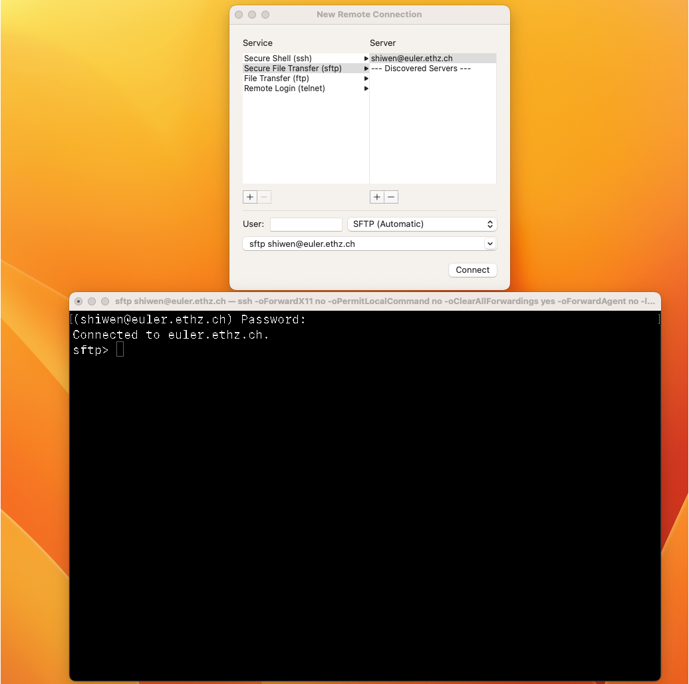

# Mac OS
## 1. Download VScode and configure C++ complier
- Already Install 'code' command in PATH command. [reference](https://code.visualstudio.com/docs/setup/mac)
- Already configured the C++ environment. [reference](https://code.visualstudio.com/docs/cpp/config-clang-mac)
- tutorials in the official webiste didn't work. Therefore, I used this [tutorial](https://www.cnblogs.com/tingcc/p/16463571.html) and succeed.


## 2. Configure Eigen
- First, I refer this [tutorial](https://blog.csdn.net/weixin_39977764/article/details/113246089?spm=1001.2101.3001.6650.7&utm_medium=distribute.pc_relevant.none-task-blog-2%7Edefault%7EBlogCommendFromBaidu%7ERate-7-113246089-blog-126923477.pc_relevant_default&depth_1-utm_source=distribute.pc_relevant.none-task-blog-2%7Edefault%7EBlogCommendFromBaidu%7ERate-7-113246089-blog-126923477.pc_relevant_default&utm_relevant_index=8) and installed homebrew
	- install homebrew [tutorial](https://brew.sh/)    Actually, it proved that we don't need to install brew,just download the Eigen file from its website.
- And, I found this tutorial didn't work, so I further refer this [tutorial](https://www.pudn.com/news/63272189272bb74d44c40705.html)
- But it still exists some faults in the PAHT. And I did following changes:
```
	"includePath": [
		"${workspaceFolder}/**"
		"/usr/local/include/Eigen"
	],


#include <iostream>
#include <Eigen/Dense>
```
- Successful!

- For Ubuntu System, follow the subsequent instructions:
	- Download: https://blog.csdn.net/qq_57061492/article/details/126163112
	- compile: https://eigen.tuxfamily.org/dox/GettingStarted.html

- configure vim : [MAC配置vim和terminal](https://blog.csdn.net/moumourenaini/article/details/115541521)
- https://www.cnblogs.com/yukina/p/16520418.html
- configure terminal in Mac OS: https://blog.csdn.net/weixin_46021869/article/details/124424215
- 再用shell安装git的时候遇到的一些问题：
	- [invalid active developer path](https://apple.stackexchange.com/questions/209624/how-to-fix-homebrew-error-invalid-active-developer-path-after-upgrade-to-os-x)
- [ ] 安装插件
- [ ] 

## 3. Configure Vim in Linux
- [tutorial](https://tanqingbo.cn/Linux-Compile-C/)


## 4. Deep learning tool
1. [tutorial](https://zhuanlan.zhihu.com/p/541651316)
	1. 不小心在base环境下也装了torch。
2. 官网安装pycharm
3.  在torch环境下安装jupyterlab 
	1. `conda install -c conda-forge jupyterlab`  
	2. `jupyter-lab` 来进行唤醒【注意要在torch环境下】


## 5. HPC

- [Install Open MPI on macOS](https://www.bilibili.com/read/cv15365733/)
- **Xcode 是运行在操作系统Mac OS X上的集成开发工具（IDE）应用软件**

## 6. 路径介绍

MAC的所有文件夹都在`Macintosh HD`这个文件夹下面，我这里称之为根文件夹`/`。根文件夹下面分别有——应用程序(Applications)、系统(System)、用户(User)、资料库(Library)。四个文件夹中又分别各有若干数量的文件夹存在。但需要注意的是，根文件夹下面还有usr、opt、bin、dev这些隐藏目录，可见[mac系统文件结构](https://blog.csdn.net/hitfyb/article/details/50864705)

- `cd /`：返回根文件夹
- `cd ~`：返回用户文件夹


# Cluster

## 1. File transer

**Two ways for transferring files between cluster and PC:**

- Using Apple's remote connection. [Ref](https://blog.csdn.net/mudisheng0202/article/details/127722441)

  

- Transfer by terminal.[Ref](https://scicomp.ethz.ch/wiki/Storage_systems#File_transfer)

  

## Complier

1. 披着g++外壳的clang
   1. Mac下安装程序出现clang: error unsupported option '-fopenmp'。参考这片[文章](http://events.jianshu.io/p/3ab95219f573)。涉及到homebrew的下载路径，以及下载后的实际安装路径，以及我们如何调用。


# Command

## brew

**basic command：**

| 命令名称        | 用途                           |
| --------------- | ------------------------------ |
| brew list       | 列出已安装的软件               |
| brew outdated   | 列出那些软件需要更新           |
| brew home       | 用浏览器打开brew官方网站       |
| brew deps       | 现实包依赖                     |
| brew list redis | 查看redis的安装文件            |
| brew cat redis  | 查看redis的brew安装脚本        |
| brew cleanup    | 删除所有软件升级后的遗留旧版本 |

**安装路径：**

> 1. 通过brew install安装应用最先是放在/opt/homebrew/Cellar/目录下。==我的电脑是这样==
> 2. 有些应用会自动创建软链接放在/usr/bin或者/usr/sbin ==Eigen就是==

- 查找在homebrew安装软件的路径，以gcc为例：`brew list opencv`

## which

在linux中，which是用来查询环境变量的地址。而这里所指的环境变量，通俗一点讲就是在当前shell中，这些如gcc这一命令是指向哪个文件。比如你安装了两个版本的gcc编译器，你就需要去设置环境变量，告诉系统当你调用gcc的时候你到底想调用哪个版本的gcc，把你想调用的那个gcc的路径和gcc绑定起来。所以，当执行上述命令，得到了编译器地址，就可以进行下一步了。如果没有，要么是环境变量中没有指定编译器路径，要么是没有安装编译器，需自行判断。

