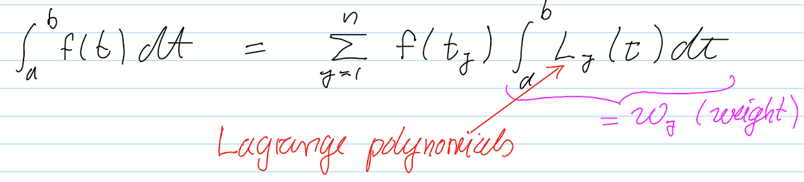
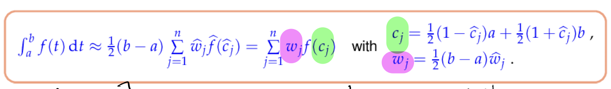

# General Coding Techniques

## Template

- The use of `<>` in C++

  - 声明类模版

    ```c++
    template <typename T> 
    MyClass{
      ...
    }
  ```
  
  - 使用：`MyClass<int>;`
  
- 可以在模版初始化中传递参数
  
    ```c++
    template <typename T, int m, int n> MyClass{
      enum {rows = m, cols = n};
    }
  ```
  
  - 使用：`Myclass<int, 1, 3>;`

## Input and Output variable

1. 输入输出对象

- `std::cerr`的使用方法
  - `std::cerr`  标准错误输出流; `std::cout` 标准输出流; `std::cerr` 与 `std::cout`的最大不同是 `cerr` 是 不带输出缓冲 的，直接就可以输出到显示器上,而 `cout` 是 带输出缓冲 的 , 需要刷新缓冲区才能输出。

- `std::cout << std::setw(5) << "n" << std::setw(15) << "kron" << std::endl;`
  -  `sew(10)`指明其后的输出项占用的字符宽度为10，即括号中的值紧跟其后的输出项占用的字符位置个数，并且给定宽度大于实际数据位数时默认向右对齐，左侧填充空格，填满给定的宽度。

2. assert

   1. ```c++
      // Use assert() to make sure A is a square matrix of
      assert(A.cols() == A.rows() && "Matrix mush be square.");
      ```

## 数据类型、运算符和表达式

### 常见函数

1. `std::log()`: 表示的其实是自然对数。要`#include <cmath>`。[cpppreference](https://en.cppreference.com/w/cpp/numeric/math/log)
2. `std::ceil()`: 表示取顶
3. `std::sqrt()`

### 循环

1. `size_t`比`unsigned int`和`unsigned long int`更好用
   1. `for (size_t i = 0; i < n; ++i){}`

### 位运算符和位运算表达式

- 左移（`<<`)
  - 设a,n是整型量，左移运算的一般格式为：`a<<n`，其意义是将a按二进制位向左移动n位，移出的高n位舍去，最低位补n个0。
  - <font color=red>对一个量左移一个二进制位，相当于乘以2操作。左移n个二进制位，相当于乘以$2^n$操作。程序运行时，左移n位比乘以$2^n$操作速度快。</font>

## 函数和运算符重载

所谓重载，就是赋予新的含义。函数重载（Function Overloading）可以让一个函数名有多种功能，在不同情况下进行不同的操作。**运算符重载（Operator Overloading）**也是一个道理，同一个运算符可以有不同的功能。


1. 函数重载

   1. 函数重载很简单，见以下例子：
      1. 
      2. 而我们很少使用函数重载的原因是因为后面我们进一步引入了**函数模版**。使用起来只需要相比以往函数多写一行即可，不需要重复定义。

2. 运算符重载

   1. 运算符重载其实就是定义一个函数，在函数体内实现想要的功能，当用到该运算符时，编译器会自动调用这个函数。也就是说，运算符重载是通过函数实现的，它本质上是函数重载。[CSDN](http://c.biancheng.net/view/2306.html)

   2. 运算符重载的格式为：

      ```c++ 
      返回值类型 operator 运算符名称 (形参表列){
        //TODO:
      }
      ```

      1. `operator`是关键字，专门用于定义重载运算符的函数。我们可以将`operator 运算符名称`这一部分看做函数名，对于上面的代码，函数名就是`operator+`。

   3. <font color=red>通常情况下，我们会在某一个类中重载运算符，该重载只对该类的对象有效。</font>

   4. ```c++
      Complex Complex::operator+(const Complex &c){
        return Complex(Real + c.Real, Image + c.Image);
      }
      ```

## 类和对象

1. C++函数名后面加一个冒号。[CSDN](https://blog.csdn.net/sinat_16643223/article/details/119895927)

   1. 冒号后面跟的是赋值，这种写法是C++的特性

   2. C++[构造函数](https://so.csdn.net/so/search?q=构造函数&spm=1001.2101.3001.7020)后面的冒号

      构造函数后加冒号是初始化[表达式](https://so.csdn.net/so/search?q=表达式&spm=1001.2101.3001.7020)，有四种情况下应该使用初始化表达式来初始化成员：

      1：初始化const成员

      2：初始化引用成员

      3：当调用基类的构造函数，而它拥有一组参数时

      4：当调用成员类的构造函数，而它拥有一组参数时。


# Eigen Techniques

在Eigen中，我们其实是进行了类模版的实例化。Eigen这个命名空间中定义了很多的模版函数，模版类，以及非模版的普通函数，普通类。如果我们用模版函数，则需要在实例化时进行制定。通常是大小和数据类型的指定。最关键的两对概念：

- 函数模版，类模版
- 函数重载，运算符重载

## Variable Related Operations

1. Initialization of matrix class:

   ```c++
   #include <Eigen/Dense>
   Eigen::MatrixXd A(n,n), D;
   //赋值
   Eigen::MatrixXd M(2,2);
   M(0,0) = 1;
   M(0,1) = 2;
   M(1,0) = 3;
   M(1,1) = 4;
   
   Eigen::MatrixXd::Identity(n,n); //一般是用来给变量初始化的，也可以用下面表示(单位矩阵)
   Eigen::MatrixXd C = Eigen::MatrixXd::Identity(n,n); //单位矩阵
   Eigen::MatrixXd C = Eigen::MatrixXd::Zero(n,n);
   Eigen::MatrixXd M(C) //也就是用C来初始化M
   M = M * M_PI / 2; //也就是M中所有元素乘0.5pi，再覆盖自己
   //Wrong syntax: Eigen::MatrixXd::Identity(A); Eigen::MatrixXd::Identity C(n,n);
   Eigen::ArrayXd J = Eigen::ArrayXd::LinSpaced(k - 1, 2, k); //非常常用的参数[1 2 3 ...]等向量的手段。总共的元素数量是（b - a + 1) 
   A.diagonal() = Eigen::VectorXd::Constant(n,b);
   //用外界函数定义
   FixedXD x;
   x = FixedXD::Zero();
   x = FixedXD::Ones();
   x = FixedXD::Constant(value);
   x = FixedXD::Random();
   x = FixedXD::LinSpaced(size, low, high);
   //用自身函数定义
   x.setZero();
   x.setOnes();
   x.setConstant(value);
   x.setRandom();
   x.setLinSpaced(size, low, high);
   ```

2. Initialization of matrix object by human (row by row)

   ```c++
   constexpr unsigned int n = 5;
   Eigen::MatrixXd A(n, n);
   A << 10, 2, 3, 4, 5, 6, 20, 8, 9, 1, 1, 2, 30, 4, 5, 6, 7, 8, 20, 0, 1, 2, 3,
         4, 10;
   
   // << 有段可以是多项式。当然对于Eigen::Matrix2d 也一样
   Eigen::Vector2d Fz = Eigen::Vector2d::Zero();
   Fz << z(0) * z(0) * z(0) - 3.0 * z(0) * z(1) * z(1) - 1.0, 3.0 * z(0);
   ```

   

   

3. Output a matrix `Eigen::MatrixXd X(n,n);std::cout<<"X = "<<X<<std::endl;`

4. Return a tuple in Code

   ```c++
   std::tuple<MatrixXd,MatrixXd,MatrixXd> svd_full (const MatrixXd&A){
     return std::tuple<MatrixXd,MatrixXd,MatrixXd>(U,Sigma,V)
   }
   ```

5. return a vector
   1. `Eigen::RowVectorXd x =Eigen::RowVectorXd::LinSpaced(n+1, 0, n)`

6. Eigen 库中 UnaryExpr 对矩阵元素施加函数的性能比较 [CSDN](https://blog.csdn.net/tonyfield2015/article/details/122762893)
   1. 
   2. ==这里是对矩阵或者向量中元素的统一赋值，相比于写循环更快。==
   3. 其形式有点像lambda函数
   4. 直接逐个访问吧，差不太多。知道并且了解这种方法即可。
   
7. `std::vector` 类型变量的定义和调用，常用来进行画图。==`Eigen::VectorXd`类型的变量能在画图中直接用吗？答，可以用==

   1. ```c++
      std::vector<double> evals, error, evals_ref;
      for (size_t i = 1; i <= N; ++i){
        qr = gaussquad(i);
        I = integrate(qr, f);
        evals.push_back(i);
        error.push_back(std::abs(I - I_ex));
        evals_ref.push_back(std::pow(i, -3));
      ```

   2. vector中元素的访问是用`[]`，这点和MatrixXd不一样。重载算子重载的是`[]`而不是`()`。

   3. 额外的操作见[cppreference](https://en.cppreference.com/w/)

   4. ==我们用vector的还有一个点是如果我们不清楚我们最终的vector有多长时，可以用`vector.push_back();`来进行填充，这在error以及solution这些结果上非常有用。==

8. 对Eigen中的每个元素都作用以函数

   1. 这一章节在Eigen手册[quick reference guide](https://eigen.tuxfamily.org/dox/group__QuickRefPage.html) 

   2. ```c++
      auto g = [f](double x) { return x * f(std::sin(x)) * std::cos(x); };
      Eigen::VectorXd gc = c.unaryExpr(g);
      ```

      1. 自己定义的lambda函数作用，然后再把值赋予给一个新的变量

   3. ```c++
      mat1.unaryExpr(std::ptr_fun(foo));
      mat1.unaryExpr(std::ref(foo));
      mat1.unaryExpr([](double x) { return foo(x); });
      ```

9. Arithmetic operators, Coefficient-wise & Array operators 全部可以参考手册这一章节[quick reference guide](https://eigen.tuxfamily.org/dox/group__QuickRefPage.html) 

   1. 一般来说，进行coefficient-wise，我们一般是先变成`.array()`，然后再用相关函数。算完之后在`.matrix()`当然，我们也可以直接`mat.cwiseAbs()`。

10. 一种特殊的定义列向量和行向量的方法

   11. ```c++
       //  Template specialization for column vectors (Eigen::VectorXd)
       //  in : x, y column vectors 
       //       X, Y matrices, used to save the mesh
       template <typename Scalar>
       void meshgrid(const Eigen::Matrix<Scalar, -1, 1>& x, 
                     const Eigen::Matrix<Scalar, -1, 1>& y,
                     Eigen::Matrix<Scalar, -1, -1>& X,
                     Eigen::Matrix<Scalar, -1, -1>& Y) {}
       
       //  Template specialization for row vectors (Eigen::RowVectorXd)
       //  in : x, y row vectors 
       //       X, Y matrices, used to save the mesh
       template <typename Scalar>
       void meshgrid(const Eigen::Matrix<Scalar, 1, -1>& x, 
                     const Eigen::Matrix<Scalar, 1, -1>& y,
                     Eigen::Matrix<Scalar, -1, -1>& X,
                     Eigen::Matrix<Scalar, -1, -1>& Y) {}
       ```

       1. 这里的-1应该表示的类似于dynamic，未知的情况。

   12. LU decomposition的重复利用，先行方程组的求解

       1. ```c++
          auto lu = df(x).lu();
          Vector y = x + lu.solve(f(x));
          return_value = y - lu.solve(f(y));
          ```

       2. 


## Slicing and Indexing

1. Most common: use `A(i,j);` to access variables.

2. For general (Matrix/Vector) slicing:

   - `seq(firstIdx,lastIdx)`:  represents the sequence of integers ranging from firstIdx to last lastIdx `seq(2,5)` $\Leftrightarrow$ `{2,3,4,5}`
   - `seq(firstIdx,lastIdx,incr)`: same but using the increment `incr` to advance from one index to the next  `seq(2,8,2)` <=> `{2,4,6,8}`
   - `seqN(firstIdx,size)`: represents the sequence of `size` integers starting from `firstIdx` `seqN(2,5)` <=> `{2,3,4,5,6}`
   -  `seqN(firstIdx,size,incr)`: same but using the increment `incr` to advance from one index to the next `seqN(2,3,3)` <=> `{2,5,8}`

    

3. For vector slicing: 
   - `x.segment(i, n)                    // x(i+1 : i+n)`
   - `x.segment<n>(i)                    // x(i+1 : i+n)`
4. For Matrix slicing:
   - `P.block(i, j, rows, cols)          // P(i+1 : i+rows, j+1 : j+cols)`
   - `P.block<rows, cols>(i, j)          // P(i+1 : i+rows, j+1 : j+cols)`

==通常，在函数模版或者类模版的提出背景是：若干程序单元（如函数定义或者类定义等）中除了所处理的数据类型不同，程序代码是一样的。但是模版形参表也可以有不一样的，即出现常规参数，见C++课本P354==

- 当<模版形参表>中出现常规参数时，在调用函数模版时，必须给出对应的实参。

  ```c++
  template <typename T, int k>
  T fun(T var1, T var2) {return (var1 + var2)/k;}
  
  int main{ float result = fun<float, 5>(a,b);return 0;}
  ```

## Function Related Operations

1. 通过函数模版来定义。适应于较为复杂的函数定义。通常我们会定义成模版函数。

   1. ```c++
      template <class Function>
      double integrate(const QuadRule& qr, const Function& f) {
        double I = 0;
        size_t n = qr.nodes_.size();
        for (size_t i = 0; i < n; ++i){
          I += qr.weights_(i) * (f(qr.nodes_(i))); 
        }
        return I;
      ```

      1. Attention: 我们在调用这个函数时，不需要具体实例化参数。直接调用即可。`double a = integrate(qr, f);`
      2. 此外，这种将变量`const`定义的方式我也可以学习

   2. ```c++
      template <class Function>
      double evalquad(const double a, const double b, Function &&f,
                      const QuadRule &Q) {
        double I = 0.;
        // TODO: (7-4.b) Use Q to approximate the integral of f over [a,b]
        // START
        for (size_t i = 0; i < Q.nodes_.size(); ++i){
          I += (b-a) / 2.0 * Q.weights_(i) * f((b-a) / 2.0 * Q.nodes_(i) + (b + a) / 2.0);
        }
        // END
        return I;
      }
      ```

      1. 这种 `Function &&f`和上面那个`Function &f`同样方式用。

2. Function Objects (函数对象)

   1. 基本概念：我们将重载了小括号`()`的类称为函数对象，也称为仿函数。因为它在使用小括号时，类似于调用函数的操作，所以称为仿函数。但是我们要知道，函数对象本质上还只是一个**类**，它并不是一个真正的函数。

   2. ```c++
      class Func
      {
        public:
        int operator()(int a, int b){
          this->count++;
          cout << a + b << endl;
          return a - b ;
        }
      }
      ```

   3. 这里补充一下对`this`的介绍：[CSDN](http://c.biancheng.net/view/2226.html)

   4. 

3. Lambda Functions.

   1. 

   2. 似乎有很多内容可以省略，在实际例子中再看

      1. 

   3. 实际例子

      1. ```c++
         //需要调用外部参数fh，所以括号内加了fh
         auto f = [fh](double x) {return std::asin(x) * fh(x);}; 
         //不需要外部调用的，无需capture。
         auto f = [](double x) { return std::sinh(x); }；
         ```
   
   4. 实际例子，lambda函数作用在向量上
   
      1. 
   
      2. 
   
      3. ```c++
         auto F = [&A, &c](const Eigen::VectorXd x){
           Eigen::VectorXd tmp = A * x + (c.array() * (x.array().exp())).matrix()
         }
         
         auto dF = [&A, &c](const Eigen::VectorXd& x){
           Eigen::MatrixXd C = A;
           Eigen::VectorXd temp = c.cwiseProduct(x.array().exp().matrix());
           C += temp.asDiagonal()
         }
         ```
   
         1. `.asDiagonal()` 这个函数要熟悉，把一个列向量变换成一个对角矩阵
         2. `eval()` 函数的使用：见[CSDN](https://blog.csdn.net/xhtchina/article/details/119817351)

## 输出

### 列表

```c++
std::cout << set::setw(3) << "N" << set::setw(15) << "I_approx" << std::setw(15) << "error" << std::endl; //太长的话可以用这个符号"\"来进行换行  
std::cout << std::setw(3) << i << std::setw(15) << I << std::setw(15) << error_gq[i-1] << std::endl;

//包含进度和科学计数法
std::cout<<std::setw(15)<<n<<std::scientific<<std::setprecision(3)\
    <<std::setw(15)<<tm_slow.min()<<std::setw(15)<<tm_fast.min()<<std::endl;
```

### 计时操作

```c++
#include "timer.h" 
Timer tm_slow, tm_fast;
 for (unsigned int n = 2; n <=256; n<<=1){
    tm_slow.reset();
    tm_fast.reset();
    for (unsigned int r = 0; r < repeats; ++r){
      d = Eigen::VectorXd::LinSpaced(n,1,2);
      
      tm_slow.start();
      lmin = rankoneinvit(d, tol);
      tm_slow.stop();
      
      tm_fast.start();
      lmin = rankoneinvit_fast(d, tol);
      tm_fast.stop();
    }
    std::cout<<std::setw(15)<<n<<std::scientific<<std::setprecision(3)\
    <<std::setw(15)<<tm_slow.min()<<std::setw(15)<<tm_fast.min()<<std::endl;
    
   std::cout<<std::setw(10)<<n<<std::setw(25)<<tm_fast.mean()\
    <<std::setw(25)<<tm_slow.mean()<<"\n";
  }
```

- 我们可以看到，有`tm_fast.min()`也有`tm_fast.mean()`

### 画图

1. Case 1

   1. ```c++
       //save figure
        plt::title("Gauss quadrature convergence");
        plt::loglog(evals,error,"+r", {{"label","Error"}});
        plt::loglog(evals,evals_ref,"k--",{{"label","O(n^-3)"}});
        plt::xlabel("No. of quadrature nodes");
        plt::ylabel("|Error|");
        plt::legend("best");
        // END
         
        plt::savefig("./cx_out/GaussConv.png");
         
        //save figure
        plt::title("Gauss quadrature convergence");
        plt::semilogy(evals,error,"+r", {{"label","Error"}});
      //  plt::loglog(evals,evals_ref,"k--",{{"label","O(n^-3)"}});
       plt::xlabel("No. of quadrature nodes");
       plt::ylabel("|Error|");
       plt::grid(); //画网格
      
       //也可以先定义路径，在画图保存
        std::string path = "./cx_out/pi_error_" + std::to_string(kmax) + ".png";
        plt::savefig(path);
      ```
      
      1. 其中，`plt::legend()`显示的图例的内容，见下图右上角
      2. 
   
2. case 2 contour绘制


### 误差控制

1. EPS

   1. `while (std::abs(dz/z) > std::numeric_limits <double>::epsilon()) { do();}` : It is meant to ensure that the relative error of the final iterative is of the size of the machine precision <font color=blue>EPS</font>.

2. 对complex domian或者二维domain上面判断两个数直接的接近程度

   1. 不需要用$\sqrt{(x-x0)^2 + (y-y0)^2}$这么复杂，直接定义一个两个Vector2d

   2. ```c++
      Eigen::Vector2d x,y;
      double dis = (x-y).norm();
      if (dis < tol) {
        do();
      }
      ```

   3. 

3. 


# 潜在考题整理

## General Approach

### 判断两个数值是否相等

一个向量减去另一个向量范数是否小于一个倍数乘EPS


std::numerical_limites

### Norm

Norms provide tools for measuring errors.


1. Norms on spaces of vectors:


2. Norms on spaces of Matrices


- In Eigen: `Eigen::MatrixXd C(D); C.norm();`

3. Norms on spaces of functions


### Tabulate制表和画图型

1. 制表
   1. 先在循环外部写一个标题输出
   2. 然后再写个循环，每一个量再输出一个数值。

### Orthogonal and Orthonormal

1. Two elements are called orthogonal


2. Orthogonal Matrices


3. Orthonormal basis


4. Vectors are orthonormal


5. Matrix with orthonormal columns. 


Conclusion: You can call that a matrix have orthonormal basis, and this is a orthogonal matrix. ==Matrix with orthonormal columns are orthogonal matrix.==

### 稀疏矩阵的使用

### 潜在计算

1. 左移（`<<`)

   - 设a,n是整型量，左移运算的一般格式为：`a<<n`，其意义是将a按二进制位向左移动n位，移出的高n位舍去，最低位补n个0。

   - <font color=red>对一个量左移一个二进制位，相当于乘以2操作。左移n个二进制位，相当于乘以$2^n$操作。程序运行时，左移n位比乘以$2^n$操作速度快。</font>

## Chapter 2-3: LSE + Decompositions (QR, SVD)

**Chapter 2:** First, introduce the main object in this chapter, LSE. Then, we discussed some theory related to the LSE: (1) Existence and Uniqueness of solutions (coefficient Matrix A invertible/regular) (2) Sensitivity or Conditioning of LSE (determined by the matrix A and the norm). Here, we define the condition (number) of a matrix. and find the effect of its value to the sensitivity of the solution. Furthermore, we discussed the methods for solving LSE. The most often methods in linear algebra is Gaussian Elimination. Then, we further discuss the matrix decomposion for solving (LU, ==normalized== Lower triangular matrix and upper triangular matrix). The computational cost for both of these methods is $O(n^3)$. In real cases, our matrix may exist some specific structures. There, we further exploit block elimination for solving matrix with specific structures. Finally, we discussed the Sparse matrix (storage of sparse matrix and how to use sparse matrix for solving LSE in eigen).

**Chapter 3:** See the outline as follows

**Analytical Solutions:**

- **Normal Equations：**For matrix with full-rank condition.
- **Moore-Penrose pseudo-inverse:** For the solution of general LSE.

**Orthogonal Transformations Methods:**

- **QR factorization:** For matrix with full-rank condition. Transfer the original matrix to triangular matrix which is easily to solve. Subsequently, the problem will be transferred into the standard LSE. (Gram-Schimit orthonormalization $\rightarrow$ Householder reflection)
- **SVD factorization:** For the solution of general LSE.

<font color=blue>In this chapter, we firstly introduce the definition of linear least squares problems.</font> Overdetermined LSE (tall coefficient matrix). Introduce some common examples (linear regression, data with pertubation) and subsequently introduced the concept of LSQ (#equations > #unknown variables). Next, we discussed the solution of such problems (least squares solution, based on the definition of the norm.). Different with the LSE, the lsq(A,b) need not be unique (when A is full-rank condition FRC, the solution is unique). Also, we explore the geometric intuition and generate the following insights: Least squares solutions always exist, which give the normal equation (full characterication of LSE can also be derived from algebric point of views). But we know that when the FRC doesn't satisfy, $AA^{T}$ is not regular (null space of $A$/$AA^T\neq\{0\}$), the solution of LSQ is not unique. In order to make the solution, we propose the generalized solution of a LSE (注意是LSE，因为当LSQ化成Normal equation已经是个LSE了), that is . 即所有可能的解中取范数最小的。通过几何上面的图像，我们推出了**Moore-Penrose pseudo-inverse**的概念。Next, based on the concept above, we propse **Normal Equation Methods**, which is our first approach to solve <font color=blue>full-rank</font> LSQ. By the way, we find that $A^TA$ is symmertic positive definite matrices ($A$ full rank). In Eigen, we use the following code. <font color=blue> However we will face two obstacles: 1. roundoff errors $\rightarrow$ loss of information in the computation of $\mathbf{A^{T}A}$ due to the EPS; 2. loss of sparsity $\rightarrow$ for large $m,n$ $\mathbf{A}\text{ sparse} \nRightarrow\mathbf{A^{T}A}\ \text{sparse}$.</font>


<font color=blue> In above section, we have introduced the **normal equation** for solving the overdertimined LSE. In this section, we will introduce another class of methods for solving LSQ inspired by Gaussian elimination. And we refer this method as Orthogonal Transformation Methods</font>

这个思路来自于GE，在GE中，我们把LSE通过转换，变成了一种易求解（triangular system）的等价LSE。因此，在这里我们想，能否把LSQ的求解矩阵也进行等价变化，变换为易求解的形式。而我们发现，确实可以，当我们把A变成triangular的时候，整个问题的求解就变成LSE了。但是这种方法的存在前提是我们在变化的时候，$\|\cdot\|_2$ preserving during transformation。而我们法相，当左乘orthogonal matrices时，可以维持住这个性质。


这使得我们回忆起了Gram-Schimidt orthonormalization.从而进一步引出QR decomposition (also economical QR decomposition. Orthogonal matrix * upper triangular matrix)[其实就是GS orthonormalization的一种等价变化]. 而我们知道，GS正交化的前提是矩阵的列向量线性无关，这也就是矩阵A是一个full rank矩阵。因此这也让我们明白QR其实只对FRC的有效，对应Normal Equation.

						

但是，基于GS-正交化去得到QR分解在数值上不具备稳定性，会出现cancelltion。因此我们又提出了两种通过几何理解实现矩阵QR分解的方法 (Householder reflections and Givens rotations)。而我们最常用的是Householder reflections,他的计算复杂度是$O(mn^2)$ with $A\in\mathbb{R}^{m,n}, m\geq n$.实现的相关代码在本章节都有（full and economical）。谈论完QR分解，又进一步谈论了用QR解LSQ。并且相关的代码实现。同时我们也比较了normal equation的方法和Orthogonal transformation method。normal equaitnion可以利用矩阵的稀疏性。而QR方法则是具有很好的数值稳定性。

 


<font color=blue> Then, we will discuss another orthogonal transformation methods - SVD decompostion.</font> 进一步讨论SVD，我们发现了很惊人的性质，对于QR decomposition,我们只有是FRC(也就是各列线性无关时)，我们最后才能成功分解出来Q这个orthogonal matrix。但是对于SVD，我们发现，无论我们的原矩阵是否是FRC，我们都可以分解（左乘m$\times$m的orthogonal matrix。右乘$n\times n$的orthogonal matrix。中间是个$m\times n$的矩阵，奇异值在对角上【在这里，不仅tall matrix可以SVD，fat matrix也可以SVD】。还有个有趣的发现，见下图：


- 如果我们的A是FRC，我们知道Null space就是0了，在SVD上就相应没有null space。而由于我们所有列都是线性无关，则展开的range space就非常大。反之，如果rank很低，那么矩阵展开的range space就很小，相应的null space就很大。

因为SVD这一章节非常重要，接下来我们又讨论了如何在Eigen中实现SVD，给出了SVD各个分量的计算方法。注意我们发现LU/QR/SVD的计算复杂度都是$O(n^3)$。Next, we discussed the potential of SVD in Optimization and Approximatin。

1. Norm-Constrained Extreme of Quadratic Forms: 基本就是范数内部做展开，取sigular values的极大/小)
   1. 与范数相关的极大和极小值问题都可以考虑用Orthogonal tranformations (QR, SVD)
2. Best Low-rank approximation: **matrix compression** 就是approximating a given "generic" matrix by means of matrix with low information content. 两种low information matrix: (1)Sparse matrix (不擅长approximate dense matrices) (2)Low-rank matrices  [这一章非常有意思，我们甚至可以把原矩阵和近似矩阵之间的误差的norm表示出来。也就是eigen values。并且可以用eigen values来控制relative compression error。见原课件，太有趣了。其本质是线性的近似]
3. Principal Component Analysis: **Trend detection, Data classification** 这里通过时间序列数据构成矩阵A。矩阵A的每一列是一组时间序列数据，代表一个trend。因此我们选择前p个特征值。p leftmost columns of $U$, 则我们可以得到我们的相应的trend。
   1. POD: detect data points $\in$ subspaces. 每一个数据点代表一个列。接着做SVD分解，选择主要的SV值。最后得到的结果基本上和PCA是一样的。不同的是这边是要取一个space，而PCA只取基。同样的方法可以用在data clalssification上面。 

### LU分解解LSE


- 可以看到`.solve()`里面不仅可以是个vector，还可以是个矩阵。

### Trick: Block elimination for LSE

Some matrix may have special structure. Under this circumstance, we want to use some tricks for fast solution. That is Block elimination.

技巧的核心是对矩阵进行block分解，列出$x$最后的求解公式，再用编程去解决。

### 稀疏矩阵的相关计算

1. storage

   1. COO [We can use this form for matrix $\times$ vector product, very amazing!]
      1. 
   2. CRS
      1. 

2. In Eigen:

   1. 

   2. ```c++
        const unsigned int n = A.rows();
        Eigen::SparseMatrix<double> C(n * n, n * n);
        std::vector<Eigen::Triplet<double>> triplets;
        Eigen::MatrixXd I = Eigen::MatrixXd::Identity(n, n);
        for (unsigned int i = 0; i < n; ++i) {
          for (unsigned int j = 0; j < n; ++j) {
            // TODO: (2-8.e) Fill in the (i,j)-th block of C.
            // Hint: The vector triplets should contain the position
            // and value the non-zero entries of C.
            // Use triplets.push_back() to add a new
            // Triplet<double> to the list.
            // START
            // Set diagonal
            if (i == j) {
              for (unsigned int k1 = 0; k1 < n; ++k1) {
                for (unsigned int k2 = 0; k2 < n; ++k2) {
                  Eigen::Triplet<double> triplet(i * n + k1, j * n + k2,
                                          A(i, j) * I(k1, k2) + A(k1, k2));
                  triplets.push_back(triplet);
                }
              }
              // Set other cells
            } else {
              for (unsigned int k = 0; k < n; ++k) {
                Eigen::Triplet<double> triplet(i * n + k, j * n + k, A(i, j));
                triplets.push_back(triplet);
              }
            }
            // END
          }
        }
        C.setFromTriplets(triplets.begin(), triplets.end());
        C.makeCompressed();
        return C;
      ```

      1. 总结来说广泛使用第一种方法。先定义triplet。然后给其赋值，初始化。接着定义`Eigen;;SparseMatrix`，然后用`.setFromTriplets()`进行操作。最后记得`.makeCompressed()`

   3. solving LSE

      1. 
      2. 定义Solver的时候直接初始化。也可以定义solver完之后再solver.compute(C).这一点和LU分解一模一样。

### Decomposition

**QR-decomposition:**


```c++
std::pair <MatrixXd , MatrixXd> qr_decomp_full (const MatrixXd& A) { Eigen::HouseholderQR<MatrixXd> qr(A);
MatrixXd Q = qr.householderQ(); //
MatrixXd R = qr.matrixQR().template triangularView<Eigen::Upper>(); return std : : pair <MatrixXd , MatrixXd >(Q,R) ;
}
```

We can also use as follows:

```c++
Eigen::MatrixXd M(n,n);
M << 8, 1, 6, 3, 5, 7, 9, 9, 2;
//Build Q
Eigen::HouseholderQR<MatrixXd> qr(n,n);
qr.compute(M);
MatrixXd Q = qr.householderQ();
```

## Chapter 5-6: Interpolation + Function Approximation

**Chapter 5:** Data interpolation的问题背景就是有$n+1$ points,从一个函数集合中(V of eligible functions) find a function (called interpolant) satisfying $n+1$ interpolation condition (IC)，最简单的一个interpolation scheme就是polygon（piecewise linear interpolation)。接着我们进一步介绍了interpolation operator的概念。也就是一个从点到函数空间（这里不同的函数空间对应于不同的operator）的映射。当你给定point和point上的值y给定的时候，我们就可以与之对应的在该函数空间的一个函数y，然后这个函数y是满足IC的==注意，interpolation operator与basis没有关系，你的这个函数空间可以有很多个基，但和interpolation operator没有关系==。然后我们便接着引出了Global polynomial interpolation的概念。也就是interpolation into spaces of functions spanned by polynomials up to a certain degree.这是最简单的interpolation scheme【理解上来说，就是我们这个interpolation operator所对应的function space是一个n阶的polynomials空间。映射的结果是我们给定一组点，值，我们便可以找到这个function space的一个唯一的函数满足它们】，这里要主要$\mathcal{P}_k$的维度是$k+1$。结果我们介绍了一种快速计算polynomial数值的方法，叫做horner scheme，课件上有相应的程序。接下来，即然operator确定好了，我们讨论的重点就是sought interpolant belongs to the polynomial space $\mathcal{P}_k$.按道理来说，我们已经知道这个空间的basis，the monomials, 因此我们只需要解一个LSE就知道这个polynomial应该为多少。注意，这个interpolant是存在且唯一的。但是，我们想到一种更快的方法来找到这个polynomial，那就是通过Lagrange Polynomials，注意，lagrange polynomial形成的一组基很特别，是一组cardinal basis<font color=red>这个地方稍微会有点疑问，为什么basis的建立是要基于interpolation nodes</font> <font color=purple>我觉得可以理解为，这个polynomial space当然有很多组基，当然基于插值点选定的一组基只是为了让我们在后面的目标函数的建立更加方便，其本质没变。包括newton basis也一样，最后得到的polynomial都是我们唯一的一个polynomial</font>。然后基于这样的cardinal basis我们可以很容易的构建我们的interpolant。


接下来我们介绍了Polynomial interpolation的一个应用，Extrapolation to zero。对于很多未提，求趋近于零时候都会不可避免地参数cacellation。而用extrepolation则不会。在整个问题中，我们需要先选定我们的插值点，然后插值，然后做一个sigular evaluation。在这里，我们引入了Aitken-Neville用来进行 ''update-friendly'' single evaluation.

接下来我们进一步介绍了Newton basis，不同于Lagrange basis，每多加一个插值点你的所有basis都要进行更新。Newton basis（leading coefficient是1）的基不用更新，但是坏消息是newton basis不是cardinal basis，这意味着我们还需要求解一个LSE从而得到其每个基前的系数，而且每新加一个点就得重新求一次LSE。因此，我们发现了divided difference，也就是新加一个点，我们可以通过类似于Aitken-Neville scheme迭代的方法，很快求得新的系数是多少。然后，Newton basis的优势是当我们做很多点的evaluation时候，我们可以用Horner scheme（因为类似于monomial，basis前的系数为1）。

最后一部分，我们讨论了Polynomial interpolation得sensitivity。这一点我们在第二章的LSE也讨论过。也就是Data(space)的一些扰动会对Result(space)造成怎样的影响。在第二章中，我们用系数矩阵A定义了condition number。而在这里，我们将会对interpolation operator进行分析。而我们知道interpolation operator的data space是点和点上的数值。因为对点的稳定性讨论太复杂，我们这里不会提及，所以我们主要研究对点上数值的稳定性分析。为了量化去表示在data space和result space里面的pertubation，我们分别在data space (vector norm)和result space（functin space）里面定义了范数。通过data space和result space，我们定义了算子范数（就有点类似于第二章的矩阵范数一样）定义的方式即是用来表达这种data space pertubation造成result space扰动的最大值。。而无穷到无穷定义出来的算子范数也被称为Lebesgue constant。而我们直观可以感受到算子范数越大，就越敏感。通过下图，我们也发现了非常有趣的一点，就是n越大，算子范数越多，越容易扰动interpolation。但是如果采用的chebychev nodes的话，则很稳定。


**Chapter 6**: 问题的背景或者动机是function很复杂或者是procedural form存在，这种时候我们就希望能够用的function approximation。不同于interpolation，多了两个步骤，一个是data nodes的选择，另一个则是approximation error的估计。因为我们需要是的approximation error最小，所以我们需要在函数空间讨论norm，therefore, we defined norms on function space (supreme norm and L2 norm)。接着，我们把我们的拟合函数选定在了polynomial。之所以这么考虑是因为受到了函数能够被Taylor series近似的启发。

接着，当我们选定用polynomials来近似function时，我们最先需要解决的是背后的理论问题。我们知道Taylor series是针对无限导连续的函数。而如果我们的被拟合函数不具备这种性质，我们能不能用Polynomial近似？第二个问题是，能否给出一个准则用来估计我们的polynomial以多快以及多精确来逼近我们的函数？这两个问题是我们需要处理的基本问题，如果这两个问题不解决没有必要接着讨论了。

对于第一个问题，我们已经证明了Uniform approximation by polynomials,即只要你的函数连续（零阶连续即可），我们就能够用一个polynomial以任意精度逼近它（Bernstein approximant)。但是，光知道这个定理只能让我们在心理上放心，但不能指导我们设计，接着，我们又解决了第二个问题，即逼近速度和误差 - Jackson theorem (best approximation estimate)。best approximant的error bound，这个error bound和polynomial的阶数有关，和函数的连续性有关，因此能够告诉我们，怎么样提升我们的逼近效果。给出error bound和阶数与连续性的规则$O(n^{-r})$。==有一点需要注意，这个error bound不是任意选的一个polynomial就能给出，而是给出的是理论最佳的逼近error bound==。我们可以看成对n是algebraic convergence，对r是expontential convergence。而这里我们首次给出了affine function的定义，一方面起可以帮我们确定任意[a,b]伤的error bound（不仅仅只是[-1,1]），另一方面也能告诉我们当有个approximation operaton定义在[1,1]上面时，我们怎么转换到[a,b]上面，这一点在quadrature里面也适用。

在搞清楚这些用polynomial近似的理论问题后，接着便进入我们的正题，polynomial interpolation的近似（polynomial 基于interpolation得出，而不是直接在$\mathcal{P}_n$里面选。而我们想知道基于interpolation的误差上限。==这里需要注意的是，因为我们在approximation函数的时候用到了Interpolation operator,而我们知道interpolation operator是与插值点和插值点上的数值有关的。在这里由于原函数已知，所以interpolation最后给出的函数是与插值点有关的。因此在我们最后给出的误差上线中，应该有关于插值点的项。而我们优化的目标就是通过选择相应的插值点使得误差bound最小==而这里我们要注意，我们的interpolation operator不能确保最后得出的就是polynomail space中的best approximation，因为interpolation operator仅仅只是一个与插值点有关的量，因此给出一个插值点就会给出一组唯一的function，至于他的误差bound是什么样，肯定不会和best approximant一样。

在分析时，我们首先选定equidistant nodes，然后先给出了一些定性上的分析，就是error bound为何种形式时，它属于什么类型的convergence(algebric, exponential)【这个过程中我们没有定量推出error bound】。接着，我们给出如何在数值试验中得出是哪种convergence。

而接下来，我们分情况讨论了对于两种不同类型的被拟合函数，其理论上的误差bound应该是多少。

- 第一种我们考虑的是finite smoothness。推导后可得
  - 可以看到quantitative error bound是非常依赖于smoothness。
  - 而注意前面定义的算子范数，即Lebesgue constant，我们可以用lebesgue constant来判断interpolation error和best approximation error之间的大小关系。【这里引出了一个点，即通过选择interpolation node而给出的polynomial不一定是best approximant。但是我们可以知道的是两者之间的差距可以用Lebesgue constant来给定，这也是为什么我们用chebsevy可以得到更好的逼近，但也仍旧不是最佳的polynomial。肯定有的点能够达到这个效果，但是我们不知道】==进一步说，知道Lebesgue constant,可能更快得到error bound==
- 第二种我们又考虑了analytic interpolands，发现其可以实现expontential convergence。我们在推导其error bound时，首先我们是在radius of convergence进行Taylor展开得到的。更进一步，当不在convergence radius里面时，我们通过扩展问题到compelx 平面解决了问题

再前面，我们讲过我们得到的polynomial的error bound应该与点有关，这里我们分析选择最优点而使得error bound最小，从而得到了chebychev polynomial决定的chebychev nodes。我们接着分析了Lebesque constant随着chebychev node的变化轨迹，以及其error bound。

### Aitken-Neville algorithm

很简单，直接用`Eigen::VectorXd`表示出interpolated points and interpolated values后套用公式。

### 根据数值试验判断convergence

在log-log scale的一定就是algebric convergence。而在lin-log scale里面的就是expontential convergence。


- 需要注意的是，不同于Q.R.那一章和Iterative method那一章，我们可以通过函数的连续性以及算法的阶数明确推出其在error图上的斜率是什么样。这一章节我们就知道对于analytic function，可以实现expontential convergence。

### 如何得到analytic function的domain of analyticity


## Chapter 7: Quadrature 

问题的背景是做积分，并且被积函数只能给出procedural form。而这里我们探讨的是这样的积分能否通过积分公式来实现，即一个积分能否用weighted sum of point values来实现。我们推到的策略是基于polynomial。现将函数用一个polynomial做近似，因为polynomial可以准确进行积分，所以我们的误差就来自于function approximation error。这又回到了上一章节的内容


通过将polynomial带进去，我们进一步得出了Polynomial quadrature formulas.注意，这个formulas仅仅只针对cardinal basis才适用，因为这样我们才能把f(t)提出来。通过采用不同degree的polynomial，我们提出了midpoint rule，trapezoidal rule。同理，如果我们的data space中，点的选择采用equidistant nodes，我们最后得到的formuls 称为Newton-cotes formulas.而如果采用chebyshew nodes，最后得到的是clenshaw-curtis rules.两者基本上都是n个点对应n degree QR，但是不同的点在于CC rules的所有系数都是正的，而Newton-cotes还存在负的，导致不稳定。



进一步，我们为了讨论不同Quadrature Rule性能的好坏，就是一个metrics（不是绝对的，系统中我们也发现不是阶数越高，性能越好），从而定义了Order of a quadrature rule。也就是这个Q.R.最佳能完美近似来自于$\mathcal{P}_m$的任意polynomial，那么它的阶数就是$m+1$。同时我们也发现affine transformation不会改变我们的order。也就是说，如果对于任意的取得n个点，如果我们想要实现最好n阶，那么我们的权重得用Lagrange polynomial基于这些点去求得。实际上，我们发现，你的点确定后，无论你用那种基，最后都能得到相同的polynomial。但是之所以我们要把Lagrange basis拿出来讲，是因为其是cardinal basis，搞好权重就是largrange basis的积分。不像任意选取的一对基，还得求LSE去得到weights。

接着，我们便知道，一个n-point的Q.R.最高能实现为2n的order。就是选择了更好的node，得到了更好的polynomial能够去积分。【这里我们还发现，虽然chebsey node可以帮助我们更好的毕竟一个函数，但不能更好的毕竟一个函数的积分，更好的逼近函数的积分还是得靠Gaussian Nodes。这是因为gaussian node只是针对我们定义的这种order的定义效果最好。order越高按道理来说近似的越好，但这不是绝对的。】。这样就得到了我们的gaussian node和gaussian quadrature。我们称之为Gauss-Legendre Quadrature formulas.

我们进一步去研究gaussian quadrature 的误差估计（这里还要提一句，gaussian weights都是正的）。我们发现，asymptotic error convergence随着smoothness而变化。并且有一个严格的公式，不像function approximation那一章无法给出严格的渐进公式。当limited smoothness时是algebric convergence with rate r。而当analytic 时时expontential convergence。并且我们也发现，通过removing a singularity of function by transformation,我们可以在一个积分问题上得到更好的convergence speed.

接着我们又讨论了Composite quadrature.也就是不用高阶的Q.R.。而是划分很多mesh。每个mesh上用低阶的来实现，但是通过比较我们发现，效果没有那么好，见下图：


- 但是这张图时对于equidistant meshes，Composite的策略比较适合用在locally refined mesh

接着我们又讨论了adaptive quadrature。其针对的是composite quadrature rule，但是对于误差较大的点我们进行refined。而对误差的估计我们采用的是高精度的quadrature rules减去低精度的quadrature rules。相似的手法我们在后的iterative methods也见过了。

### [-1, 1] 到 [a, b] Numerical Transformation



### 根据数值试验判断采用的算法

<font color=red>我们可以发现，基本上所有的问题都是error（即数值算法和真实结果之间的误差）随着我们数值算法中的某一个variable如何发生变化。</font>

Numerical Quadrature 中有关于compostie quadrature的方法和传统高阶方法的比较。通过数值试验进行判断，这类型题也很重要。

### Adaptive Quadrature rule 那道posterior的习题。

掌握这个相关的策略。也可以用在Numerical Integration的选择上。

### Removing the singularity by transformation

通过一些函数变化。

## Chapter 8: Iterative Methods

Iterative methods的核心就是通过自身不断的iteration，产生一组sequences，而这组sequences的结局往往是收敛到一个point。我们想让iterative 解决某个问题，就要证明iterative methods和这个问题等价，通常我们的任务是寻找零点$F(x)=0$。当我们知道解析式$F(x)$时，我们可以通过式子构造一个iterative过程。当我们只能以procedural form逐点evaluation，我们也能有诸如Newton methods等。

问题的背景是general method for solving linear/nonlinear system of equations.我们把方程转换成函数的形式，问题变成了寻找零点。理想上，我们想得到$\Phi(\mathbf{x^{\ast}})=\mathbf{x^\ast}$这样的压缩映射，而$\mathbf{F(x^{\ast})}=\Phi(\mathbf{x^{\ast}})-\mathbf{x^\ast}$。然后iterative methods根据选择的点的数量不同，分为single point和multiple point。而我们此章节的目的就是找到itertative function从而等价于我们的函数零点问题。

在讨论前，我们先讨论了speed of convergence的概念：。这称之为order of convergence with the order $p$. ⚠️和前面讨论的不同的地方在于：前面很少有给出上一步error和下一步error之间的比较的。而是直接给出error与我算法的某个variable（通常越到的variable会增加算法的复杂度）的比较。而这里定义的order，可以通过tabulate来进行得到：

下面，我们讨论当我用一个iterative methods去解决问题时，stopping rules应该怎么去。我们发现了三种

- priori termination； residual-based termination； correction-based termination（后一步的值相比于当前步基本没发生发变化）

<font color=blue>After introducing these basics of iterative methods, let's concentrate on concrete methods</font>

1. **Fixed point iterations:** 就是知道解析式子，然后我们根据解析式子设计我们的compressed iteration function.而我们通常也会有many possibilities corresponding different convergent speed.在这个情况中，我们也发现了一个lemma：就是只有当不动点处的Jacobian matrix（或者倒数）小于1的时候，fixed point iteration才能够局部收敛，并且最少线性收敛。
2. **Bisection:** 通过不断取中点，选择符号相反的两端，从而压缩零点的范围 <font color=red>scalar function.</font>
3. **Model function method:** 每一步迭代都会取一个所谓的model function $\tilde{F}(x)$。而通过这个model function等于0来更新下一步。当前步的model function又依赖于前一步的值
   1. **Newton Method** : scalar form $x^{k+1}=x^k -\frac{f(x^k)}{f^`(x^k)}$ 导函数在下面。vector form就是jacobian的逆。And we know that Newton's method locally quadratically converge to a zero of $F$。这里涉及到implicit form时，我们如何得到函数的导数。
   2. **Multi-point Method:** we use multi-point to construct our model function. N.I. is just a single-point method.
      1. **The secant method:** replace $F$ with interpolating polynomial
         1. 
         2. good thing: 没用到导数信息。
         3. order of convergence ~1.62
      2. **Inverse interpolation:**
         1. 
         2. 这个逆函数插值的做法属实漂亮

讨论完基本的方法后，我们来讨论iterative methods for zero finding的asymptotic efficiency。由于该问题又很多算法，所以效率定义为所获的的精度比上这个过程中的计算开销（point evaluation和导数的evaluation）。而精度我们定义为：

<font color=blue>Next, we discussed Netwon's method in $\mathbb{R}^n$之所以Newton法用的多时因为其在处理多变量的zero finding时也能有一个同意的范式。</font>

我们首先讨论的是Multi-dimensional Differentiation.这里讨论了函数求导的chain rule和product rule【之所以在这一章的讨论都要加上$h$是因为这是根据我们对derivative的定义来决定的，即线性近似。此外，这里的h就可以看成之后我们LSE的求解变量即newton correction】。这里有几个常见的导数：

- 函数的逆的导数

在多变量牛顿迭代中，问题的核心就是求得Jacobian。从而进一步基于Jacobian解LSE，则可以得到我们的Newton correction。注意Netwon correction是带符号的，则最后的结果就是$x_k$ + newton correction = $x_{k+1}$ 

接着，我们讨论一下Convergence of Netwton‘s method。关于order的定义与前面保持一致。通常，和scalar的形式一致，局部是二阶收敛。然后stopping rules就是newton correction的范数：。此外，也讨论了一下simplified netwon correction，但没什么新鲜的，也就是少算了一次Jacobian和LSE而已。


因此又讨论了damped Newton methods

### Iterative methods is consistent with $\mathbf{F(x)=0}$ 

- Ideas: 1. $\mathbf{F(x^{\ast})}=0\rightarrow\Phi(\mathbf{x^{\ast}})=\mathbf{x^\ast}$   2. $\Phi(\mathbf{x^{\ast}})=\mathbf{x^\ast}\rightarrow\mathbf{F(x^{\ast})}=0$. The problem may give us other assumptions.

### Newton Method for Implicit form 

### 常用函数模型的导数形式


## Chapter 11-12 Single Step Methods for IVP

This chapter mainly discuss the numerical algorithm for the solution of ordinary differential equations. First, we introduce what is initial value problems and numerical algorithm is equal to the discrete evolution operators. Then we introduce some common (polygonal methods) for ODE, including explicit, implicit and implicit midepoint. By summarizing these methods, we propose the concept of general single-step method. Subsequently, we discuss the convergence of error for these methods and define the order. But we find the order of these method is not so high, we want to find higher order method. Then, we talked about **explicit Runge-Kutta single-step method**. Finally, we disscussed the algorithm of adaptive stepsize control (error = high-order method - low-oder) like that in the Q.R.

Then, we find a very interesting class of problems - **stiff initial-value problems**, and find that explicit method is hard to solve these problems - we need to derive the domain of stability for the $h$ (smaller that that needed for the precision - defined of stiff). Then, we find implicit method have ideal-stability (A-stability $\mathbb{R}_{-}$). In order to achieve these problems in high-order, we further introduce the **implicit-RK** (different Butcher Scheme). However, applying implicit-RK needs to solve (Non-)linear system of equations with $s\cdot N$ unknowns (several expensive newton iterations need to find increments $k_i$). We further propose **Semi-inplicit RK methods**, which can preseve the order of implicit order but having higher efficiency. Finally, we find many relevant ordinary differential equations feature a right hand side function that is the sum to two (or more) terms. And we propose the method called splitting methods, meaning that solving two ODEs with numerical evolution operators and then combining them. Occasions often happen with one stiff (use analytical evolution operators) and another general cases (use numerical evolution operators).

### $\mathcal{Y}(0)$ orthogonal $\rightarrow$ $\mathcal{Y}(t)$ orthogonal $\forall t$

- Do the derivate to prove a variable unchanged with time .

### Speed of convergence of polygonal methods (compared with Q.R.)

First, define the error based on norms. Then, analyze the decrese of the error with the parameter, which is important for our algorithms.

- Asymptotic convergence of single step methods for the IVP of ODE system:
  - 
  - 
  - 
  - 
  - 
- Asymptotic estimates for Numerical Quadrature
  - Algebraic convergence:
  - Expontential convergence:
  - ==we can see that compared with SSM for ODE, substitute the $h$ with $1/n$.==

### First-order IVP of high order form


### Runge-Kutta Methods

#### Explicit Runge-Kutta Methods

==因为题目中多是autonomous system，所以我们基本用不上$c$的信息。==

The most widely used class of numerical integrators for IVPs. They are usually described by giving their coefficients in the form of a Butcher scheme.

NOTE!! Runge-Kutta is often defined as a class. The Butcher scheme is initialized when using constructor function.

- constructor function: initialization


- Solve concrete function
  - 每一步的state更新是在private函数里面执行的。这个里面是传进去指针。但是我觉得直接用引用应该也行吧。不需要按照它这个答案这里这样写。


- Step updated function
  - private function，只能class内部进行调用，保护起来。
  - 整个求解思路也非常简单，建立一个k向量（有些情况是矩阵）来存储increments。写一个嵌套的循环来更新存储increments。最后在矩阵运算或者写个小循环进行求解即可。


- Implement butcher scheme matrix
  - 

- Function
  - 
- RK要写出类模版的形式，因为输入的f可能是个vector

`res.reserve(N+1)` Increase the capacity of the vector (the total number of elements that the vector can hold without requiring reallocation) to a value that's greater or equal to new_cap. If new_cap is greater than the current `capacity()`, new storage is allocated, otherwise the function does nothing.

#### Implicit Runge-Kutta Method


#### Semi-implicit Runge-Kutta SSM

# Tricks

1. Check the orthonormality of the columns of the matrix.

   ```c++
   Q = gram_schmidt(A); //Q is derived by Gram-Schmidt Orthogonalization
   const double err = (Q.transpose()*Q-Eigen::MatrixXd::Identity(n,n)).norm();
   bool orthonormal = false;
   orthonormal = err < eps;
   ```

   - This tricks is very useful for checking the orthonormality

2. Computes the root of complex number without cancellation
   $$
   \text{complex number:} w=u+iv,\ u,v\in\R\ \text{with }v\geq0\text{, its root}\sqrt{w}=x+iy\\
   x\equiv\sqrt{(\sqrt{u^2+v^2}+u)/2}\\
   y\equiv\sqrt{(\sqrt{u^2+v^2}-u)/2}\\
   $$

   - 

   - Therefore, how to compute root of complex number without cancellation. Due to the reason that $xy=v/2$.  The idea is to first compute either $x$ or $y$, whichever is possible in a stable fashion (If $u > 0$ compute $y$, otherwise compute $x$.), and then us the formula $2xy = v$ to obtain the other variable.

     - ```c++
         if(v == 0) std::sqrt(u);
         if(u > 0) {
           x = std::sqrt((std::sqrt(u*u+v*v)+u)/2);
           y = v/2/x;
         }
         else{
           y = std::sqrt((std::sqrt(u*u+v*v)-u)/2);
           x = v/2/y;
         }
       ```

3. Implement an efficient code for calculating $\mathbf{y=Ax}$ with $\mathbf{A}$ is banded matrix 

   

   1. ```c++
        if (n > 1) y(0) = 2 * x(0) + a(0) * x(1);
        else{y(0) = 2 * x(0); return y;}
        if (n > 2){
          y(1) = 2 * x(1) + a(1) * x(2);
        }
        else{
          y(1) = 2 * x(1);
          return y;
        }
        if (n >= 3){
          for (unsigned int i = 2; i<n-1; ++i){
            y(i) = b(i-2) * x(i-2) + 2 * x(i) + a(i) * x(i+1);
          }
        }
        if (n>=3) y(n-1) = b(n-3) * x(n-3) + 2 * x(n-1);
        // END
        return y;
      ```

      **Note:** Don't forget to add`;` behind `return y`.

4. If we want to prove that a matrix $\mathbf{A}$ is invertible, we can prove that $\textbf{ker}\mathbf{A}=\{0\}$ by contradiction.

5. Check the orthogonality of two vectors.
   1. `return_val&=(std::abs(V.row(k).dot(V.row(l)))<tol*100.);`
   2. `constexpr double tol=std::numeric_limits<double>::epsilon(); \\machine epsilon`


# Quickref

1. A simple quickref for Eigen

   ```c++
   // A simple quickref for Eigen. Add anything that's missing.
   // Main author: Keir Mierle
   
   #include <Eigen/Dense>
   
   Matrix<double, 3, 3> A;               // Fixed rows and cols. Same as Matrix3d.
   Matrix<double, 3, Dynamic> B;         // Fixed rows, dynamic cols.
   Matrix<double, Dynamic, Dynamic> C;   // Full dynamic. Same as MatrixXd.
   Matrix<double, 3, 3, RowMajor> E;     // Row major; default is column-major.
   Matrix3f P, Q, R;                     // 3x3 float matrix.
   Vector3f x, y, z;                     // 3x1 float matrix.
   RowVector3f a, b, c;                  // 1x3 float matrix.
   VectorXd v;                           // Dynamic column vector of doubles
   double s;                            
   
   // Basic usage
   // Eigen          // Matlab           // comments
   x.size()          // length(x)        // vector size
   C.rows()          // size(C,1)        // number of rows
   C.cols()          // size(C,2)        // number of columns
   x(i)              // x(i+1)           // Matlab is 1-based
   C(i,j)            // C(i+1,j+1)       //
   
   A.resize(4, 4);   // Runtime error if assertions are on.
   B.resize(4, 9);   // Runtime error if assertions are on.
   A.resize(3, 3);   // Ok; size didn't change.
   B.resize(3, 9);   // Ok; only dynamic cols changed.
                     
   A << 1, 2, 3,     // Initialize A. The elements can also be
        4, 5, 6,     // matrices, which are stacked along cols
        7, 8, 9;     // and then the rows are stacked.
   B << A, A, A;     // B is three horizontally stacked A's.
   A.fill(10);       // Fill A with all 10's.
   
   // Eigen                                    // Matlab
   MatrixXd::Identity(rows,cols)               // eye(rows,cols)
   C.setIdentity(rows,cols)                    // C = eye(rows,cols)
   MatrixXd::Zero(rows,cols)                   // zeros(rows,cols)
   C.setZero(rows,cols)                        // C = zeros(rows,cols)
   MatrixXd::Ones(rows,cols)                   // ones(rows,cols)
   C.setOnes(rows,cols)                        // C = ones(rows,cols)
   MatrixXd::Random(rows,cols)                 // rand(rows,cols)*2-1            // MatrixXd::Random returns uniform random numbers in (-1, 1).
   C.setRandom(rows,cols)                      // C = rand(rows,cols)*2-1
   VectorXd::LinSpaced(size,low,high)          // linspace(low,high,size)'
   v.setLinSpaced(size,low,high)               // v = linspace(low,high,size)'
   VectorXi::LinSpaced(((hi-low)/step)+1,      // low:step:hi
                       low,low+step*(size-1))  //
   
   
   // Matrix slicing and blocks. All expressions listed here are read/write.
   // Templated size versions are faster. Note that Matlab is 1-based (a size N
   // vector is x(1)...x(N)).
   /******************************************************************************/
   /*                  PLEASE HELP US IMPROVING THIS SECTION                     */
   /* Eigen 3.4 supports a much improved API for sub-matrices, including,        */
   /* slicing and indexing from arrays:                                          */
   /* http://eigen.tuxfamily.org/dox-devel/group__TutorialSlicingIndexing.html   */
   /******************************************************************************/
   // Eigen                           // Matlab
   x.head(n)                          // x(1:n)
   x.head<n>()                        // x(1:n)
   x.tail(n)                          // x(end - n + 1: end)
   x.tail<n>()                        // x(end - n + 1: end)
   x.segment(i, n)                    // x(i+1 : i+n)
   x.segment<n>(i)                    // x(i+1 : i+n)
   P.block(i, j, rows, cols)          // P(i+1 : i+rows, j+1 : j+cols)
   P.block<rows, cols>(i, j)          // P(i+1 : i+rows, j+1 : j+cols)
   P.row(i)                           // P(i+1, :)
   P.col(j)                           // P(:, j+1)
   P.leftCols<cols>()                 // P(:, 1:cols)
   P.leftCols(cols)                   // P(:, 1:cols)
   P.middleCols<cols>(j)              // P(:, j+1:j+cols)
   P.middleCols(j, cols)              // P(:, j+1:j+cols)
   P.rightCols<cols>()                // P(:, end-cols+1:end)
   P.rightCols(cols)                  // P(:, end-cols+1:end)
   P.topRows<rows>()                  // P(1:rows, :)
   P.topRows(rows)                    // P(1:rows, :)
   P.middleRows<rows>(i)              // P(i+1:i+rows, :)
   P.middleRows(i, rows)              // P(i+1:i+rows, :)
   P.bottomRows<rows>()               // P(end-rows+1:end, :)
   P.bottomRows(rows)                 // P(end-rows+1:end, :)
   P.topLeftCorner(rows, cols)        // P(1:rows, 1:cols)
   P.topRightCorner(rows, cols)       // P(1:rows, end-cols+1:end)
   P.bottomLeftCorner(rows, cols)     // P(end-rows+1:end, 1:cols)
   P.bottomRightCorner(rows, cols)    // P(end-rows+1:end, end-cols+1:end)
   P.topLeftCorner<rows,cols>()       // P(1:rows, 1:cols)
   P.topRightCorner<rows,cols>()      // P(1:rows, end-cols+1:end)
   P.bottomLeftCorner<rows,cols>()    // P(end-rows+1:end, 1:cols)
   P.bottomRightCorner<rows,cols>()   // P(end-rows+1:end, end-cols+1:end)
   
   // Of particular note is Eigen's swap function which is highly optimized.
   // Eigen                           // Matlab
   R.row(i) = P.col(j);               // R(i, :) = P(:, j)
   R.col(j1).swap(mat1.col(j2));      // R(:, [j1 j2]) = R(:, [j2, j1])
   
   // Views, transpose, etc;
   /******************************************************************************/
   /*                  PLEASE HELP US IMPROVING THIS SECTION                     */
   /* Eigen 3.4 supports a new API for reshaping:                                */
   /* http://eigen.tuxfamily.org/dox-devel/group__TutorialReshape.html           */
   /******************************************************************************/
   // Eigen                           // Matlab
   R.adjoint()                        // R'
   R.transpose()                      // R.' or conj(R')       // Read-write
   R.diagonal()                       // diag(R)               // Read-write
   x.asDiagonal()                     // diag(x)
   R.transpose().colwise().reverse()  // rot90(R)              // Read-write
   R.rowwise().reverse()              // fliplr(R)
   R.colwise().reverse()              // flipud(R)
   R.replicate(i,j)                   // repmat(P,i,j)
   
   
   // All the same as Matlab, but matlab doesn't have *= style operators.
   // Matrix-vector.  Matrix-matrix.   Matrix-scalar.
   y  = M*x;          R  = P*Q;        R  = P*s;
   a  = b*M;          R  = P - Q;      R  = s*P;
   a *= M;            R  = P + Q;      R  = P/s;
                      R *= Q;          R  = s*P;
                      R += Q;          R *= s;
                      R -= Q;          R /= s;
   
   // Vectorized operations on each element independently
   // Eigen                       // Matlab
   R = P.cwiseProduct(Q);         // R = P .* Q
   R = P.array() * s.array();     // R = P .* s
   R = P.cwiseQuotient(Q);        // R = P ./ Q
   R = P.array() / Q.array();     // R = P ./ Q
   R = P.array() + s.array();     // R = P + s
   R = P.array() - s.array();     // R = P - s
   R.array() += s;                // R = R + s
   R.array() -= s;                // R = R - s
   R.array() < Q.array();         // R < Q
   R.array() <= Q.array();        // R <= Q
   R.cwiseInverse();              // 1 ./ P
   R.array().inverse();           // 1 ./ P
   R.array().sin()                // sin(P)
   R.array().cos()                // cos(P)
   R.array().pow(s)               // P .^ s
   R.array().square()             // P .^ 2
   R.array().cube()               // P .^ 3
   R.cwiseSqrt()                  // sqrt(P)
   R.array().sqrt()               // sqrt(P)
   R.array().exp()                // exp(P)
   R.array().log()                // log(P)
   R.cwiseMax(P)                  // max(R, P)
   R.array().max(P.array())       // max(R, P)
   R.cwiseMin(P)                  // min(R, P)
   R.array().min(P.array())       // min(R, P)
   R.cwiseAbs()                   // abs(P)
   R.array().abs()                // abs(P)
   R.cwiseAbs2()                  // abs(P.^2)
   R.array().abs2()               // abs(P.^2)
   (R.array() < s).select(P,Q );  // (R < s ? P : Q)
   R = (Q.array()==0).select(P,R) // R(Q==0) = P(Q==0)
   R = P.unaryExpr(ptr_fun(func)) // R = arrayfun(func, P)   // with: scalar func(const scalar &x);
   
   
   // Reductions.
   int r, c;
   // Eigen                  // Matlab
   R.minCoeff()              // min(R(:))
   R.maxCoeff()              // max(R(:))
   s = R.minCoeff(&r, &c)    // [s, i] = min(R(:)); [r, c] = ind2sub(size(R), i);
   s = R.maxCoeff(&r, &c)    // [s, i] = max(R(:)); [r, c] = ind2sub(size(R), i);
   R.sum()                   // sum(R(:))
   R.colwise().sum()         // sum(R)
   R.rowwise().sum()         // sum(R, 2) or sum(R')'
   R.prod()                  // prod(R(:))
   R.colwise().prod()        // prod(R)
   R.rowwise().prod()        // prod(R, 2) or prod(R')'
   R.trace()                 // trace(R)
   R.all()                   // all(R(:))
   R.colwise().all()         // all(R)
   R.rowwise().all()         // all(R, 2)
   R.any()                   // any(R(:))
   R.colwise().any()         // any(R)
   R.rowwise().any()         // any(R, 2)
   
   // Dot products, norms, etc.
   // Eigen                  // Matlab
   x.norm()                  // norm(x).    Note that norm(R) doesn't work in Eigen.
   x.squaredNorm()           // dot(x, x)   Note the equivalence is not true for complex
   x.dot(y)                  // dot(x, y)
   x.cross(y)                // cross(x, y) Requires #include <Eigen/Geometry>
   
   //// Type conversion
   // Eigen                  // Matlab
   A.cast<double>();         // double(A)
   A.cast<float>();          // single(A)
   A.cast<int>();            // int32(A)
   A.real();                 // real(A)
   A.imag();                 // imag(A)
   // if the original type equals destination type, no work is done
   
   // Note that for most operations Eigen requires all operands to have the same type:
   MatrixXf F = MatrixXf::Zero(3,3);
   A += F;                // illegal in Eigen. In Matlab A = A+F is allowed
   A += F.cast<double>(); // F converted to double and then added (generally, conversion happens on-the-fly)
   
   // Eigen can map existing memory into Eigen matrices.
   float array[3];
   Vector3f::Map(array).fill(10);            // create a temporary Map over array and sets entries to 10
   int data[4] = {1, 2, 3, 4};
   Matrix2i mat2x2(data);                    // copies data into mat2x2
   Matrix2i::Map(data) = 2*mat2x2;           // overwrite elements of data with 2*mat2x2
   MatrixXi::Map(data, 2, 2) += mat2x2;      // adds mat2x2 to elements of data (alternative syntax if size is not know at compile time)
   
   // Solve Ax = b. Result stored in x. Matlab: x = A \ b.
   x = A.ldlt().solve(b));  // A sym. p.s.d.    #include <Eigen/Cholesky>
   x = A.llt() .solve(b));  // A sym. p.d.      #include <Eigen/Cholesky>
   x = A.lu()  .solve(b));  // Stable and fast. #include <Eigen/LU>
   x = A.qr()  .solve(b));  // No pivoting.     #include <Eigen/QR>
   x = A.svd() .solve(b));  // Stable, slowest. #include <Eigen/SVD>
   // .ldlt() -> .matrixL() and .matrixD()
   // .llt()  -> .matrixL()
   // .lu()   -> .matrixL() and .matrixU()
   // .qr()   -> .matrixQ() and .matrixR()
   // .svd()  -> .matrixU(), .singularValues(), and .matrixV()
   
   // Eigenvalue problems
   // Eigen                          // Matlab
   A.eigenvalues();                  // eig(A);
   EigenSolver<Matrix3d> eig(A);     // [vec val] = eig(A)
   eig.eigenvalues();                // diag(val)
   eig.eigenvectors();               // vec
   // For self-adjoint matrices use SelfAdjointEigenSolver<>
   ```

   

   