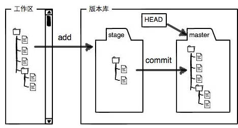

# Github 简明教程
常用命令：[PDF](PDF/git-cheat-sheet.pdf)

- 什么是Github？

  GitHub是一个基于git的代码托管平台，付费用户可以创建私人仓库，我们一般的免费用户只能使用公共仓库，也就是代码要公开。

  就是一个远程仓库，这个网站提供Git仓库托管服务的。

  

# Git用法

开发git的初衷：

传统我们用word进行版本控制时，每隔一段时间我们都得保存一下，这样很麻烦，且不利于我们回顾这些不同版本之间有哪些变动。因此，我们希望有一个软件，不但能自动帮我记录每次文件的改动，还可以让同事协作编辑，这样就不用自己管理一堆类似的文件了，也不需要把文件传来传去，如果想看某次改动，只需要在软件里瞄一眼就可以，岂不是很方便。这样，我们就进入到了版本控制的20世纪。==版本控制系统==

Linus花两周时间自己用C写了一个分布式版本控制系统，这就是Git！一个月之内，Linux系统的源码已经由Git管理了！

Git迅速成为最流行的分布式版本控制系统，尤其是2008年，Github网站上线了，它为开源项目免费提供Git存储，无数开源项目开始迁移至GitHub。

- 集中式vs分布式

  先说集中式版本控制系统，版本库是集中存放在中央服务器的，而干活的时候，用的都是自己的电脑，所以要先从中央服务器取得最新的版本，然后开始干活，干完活了，再把自己的活推送给中央服务器。中央服务器就好比是一个图书馆，你要改一本书，必须先从图书馆借出来，然后回到家自己改，改完了，再放回图书馆。其系统最大的毛病就是必须联网才能工作。

  那分布式版本控制系统与集中式版本控制系统有何不同呢？首先，分布式版本控制系统根本没有“中央服务器”，每个人的电脑上都是一个完整的版本库，这样，你工作的时候，就不需要联网了，因为版本库就在你自己的电脑上。既然每个人电脑上都有一个完整的版本库，那多个人如何协作呢？比方说你在自己电脑上改了文件A，你的同事也在他的电脑上改了文件A，这时，你们俩之间只需把各自的修改推送给对方，就可以互相看到对方的修改了。

  

---

## Git简介

* 作者

  Linus Toward 

* 概念

  分布式版本控制系统

* 源码语言

  C语言

* git结构

  工作区：仓库中展示的可编辑的界面【就是你在电脑界面能看到的目录，某个文件夹】

  暂存区：工作区提交给版本库之前的缓存区域 （stage，或者叫index）

  版本库：记录文件修改历史版本的仓库 （master，以及只想master的一个指针叫HEAD）

- 版本库（Repository)

工作区有一个隐藏目录`.git`，这个不算工作区，而是Git的版本库。
Git的版本库里存了很多东西，其中最重要的就是stage（或者index）的暂存区，还有Git为我们自动创建的第一个分支`master`，以及指向`master`的一个指针叫`HEAD`。

我们把文件往Git版本库里添加的时候，是分两步执行的：
第一步是用`git add`把文件添加进去，实际上就是把文件修改添加到暂存区；
第二步时用`git commit`提交更改，实际上就是把暂存区的所有内容提交到当前分支。

因为我们创建Git版本库时，Git自动为我们创建了唯一一个`master`分支，所以，现在，`git commit`就是往`master`分支上提交更改。

你可以简单理解为，需要提交的文件修改通通放到暂存区，然后，一次性提交暂存区的所有修改。

## Git安装

* Windows操作系统

  [官网](https://git-scm.com/)下载exe安装包进行安装

* Linux操作系统

  ```bash
  sudo apt-get install git
  ```


## Git全局配置

* git配置文件路径

  `~/.gitconfig`

* 查看git相关配置

  ```bash
  git config --list
  ```

* 配置[全局]用户名和邮箱

  ```bash
  git config [--global] user.name "用户名"
  git config [--global] user.email "电子邮箱"
  ```

  - 这里配置用户名的意思是：因为git是分布式版本控制系统，所以每个机器必须自报家门：你的名字和Email地址。
  - 注意```git config```命令的```--global```参数，用了这个参数，表示你这台机器上所有的git仓库都会使用这个配置，当然也可以对某个仓库指定不同的用户名和Email地址。


## Git仓库操作

概念：版本库又名仓库，英文名repository，你可以简单理解成一个目录，这个目录里面的所有文件都可以被Git管理起来，每个文件的修改、删除，Git都能追踪，以便任何时刻都可以追踪历史，或者在将来某个时刻可以“还原”。__需要明确一下，所有的版本控制系统，其实只能跟踪文本文件的改动，__比如TXT文件，网页，所有程序代码等等，Git也不例外。版本控制系统可以告诉你每个的改动，比如在第5行加了一个单词“Linux"，在第八行删了一个单词"windows"。word这种文件也不能知道，如果要真正使用版本控制系统，就要以纯文本方式编写文件。

强烈建议使用标准的UTF-8编码，所有语言使用同一种编码，既没有冲突，又被所有平台支持。

* 创建git仓库

  将当前所在文件夹创建为git仓库，需要在当前目录下输入以下命令

  ```bash
  git init
  ```

  - 这时会发现当前目录下多了一个```.git```目录，这个目录是Git来追踪管理版本库的，没事千万不要手动修改。
  - 如果你没有看到```.git```目录，那是因为这个目录是隐藏的，用```ls -ah```命令就可以看见

* 将工作区修改添加至暂存区

  ```bash
  git add 文件一 [文件二 文件三 ...]    // 将工作区的指定修改提交至暂存区
  git add -A    // 将工作区所有的修改提交至暂存区
  ```

* 将暂存区的内容作为一个新的版本提交给版本库

  ```bash
  git commit -m "版本提交日志"
  ```

* 查看当前仓库工作区和暂存区的修改状态

  ```bash
  git status
  ```

* 对比工作区和版本库中最新版本的区别

  ```bash
  git diff HEAD -- [文件名]    // 可以通过文件名指定查看单个文件在工作区和版本库中的区别
  git diff readme.txt		//readme.txt在工作区和版本库之间的区别
  ```

  

## 版本回退

- 丢弃工作区的修改（但是暂缓区的内容不会调动）

  ``` bash 
  git checkout -- 文件名
  ```

* 将暂存区修改撤销掉，重新放回至工作区

  ```bash
  git reset HEAD 文件名
  ```

* 回退版本库的版本（用git log查看时，HEAD是当前版本）

  ```bash
  git reset --hard HEAD^    // 回退至上一个版本
  git reset --hard HEAD^^	  // 回退至上上一个版本
  git reset --hard 版本号    // 回退至指定版本号对应的版本
  ```

* 查看版本库的版本提交日志【这个版本库的版本提交日子可以使得我们将版本库回退到之前使用的版本】

  ```bash
  git log [--graph --all --pretty=oneline]    // 仅有文件提交的版本日志,--graph可以让日志以图形化方式现实，--all表示展示所有分支的版本提交日志，--pretty是用来设置每次提交内容单行显示
  git reflog    // 包含所有操作的版本日志，其实就是记录了每一次命令（包含对仓库本身的操作）
  ```

- 删除文件

  ``` bash
  rm test.md  //删除掉文件
  git rm test.md //的确需要删除此文件，之后再用git commit -m "remove test.md" 提交一下
  git checkout -- test.md
  ```

  - 总结可以知道，git checkout其实是用版本库里的版本替换工作区的版本，无论工作区是修改还是删除，都可以”一键还原“
  - 但需要注意：从来没有被添加到版本库就被删除的文件，是无法回复的！


## 分支管理

每次提交，Git都把它们串成一条时间线，这条时间线就是一个分支。截止到目前，只有一条时间线，在Git里，这个分支叫主分支，即master分支。HEAD严格来说不是指向提交，而是指向master，master才是指向提交的，所以，HEAD指向的就是当前分支。

* 查看当前所在分支

  ```bash
  git branch [-a]    // -a表示查看包括本地和远端的所有分支
  ```

* 创建分支

  ```bash
  git branch 分支名    // 创建后不会自动切换
  git checkout -b 分支名    // 创建分支并切换至该分支(去掉-b就是不创建分支，直接切换分支)
  git switch -c 分支名	  //新版的切换分支，同git -b checkout，为了以防和撤销命令弄混
  git switch 分支名   //同git checkout
  ```

* 切换分支

  ```bash
  git checkout [-f] 分支名    // -f表示丢弃未提交的修改强制切换
  ```

* 合并分支

  ```bash
  git merge 分支名    // 将分支名指定分支合并到当前所在分支
  ```

* 删除分支

  ```bash
  git branch -d 分支名    // 删除已合并过的分支
  git branch -D 分支名    // 删除未合并过的分支
  ```


- 解决分支冲突（在连个不同的分支中都进行了git add 和git commit

  ``` bash
  git merge feature1 //想要合并
  git status //发生冲突，故查看status
  cat readme.txt  //查看文件（文件中会显示冲突）
  vi readme.txt  //修改文件（把冲突修改过来）
  ```


## 远程库

* 在本地仓库关联远程库

  ```bash
  git remote add 远端仓库名 远端仓库URL    // 远端仓库名可以自定义，之后对远端库操作均可使用该名称
  ```

* 在本地仓库接触与远端仓库的关联关系

  ```bash
  git remote rm 远端仓库名
  ```

* 查看本地仓库与远端仓库的关联关系

  ```bash
  git remote -v
  ```

* 将远端仓库下载至本地并直接建立关联关系

  ```bash
  git clone 远端仓库URL
  ```

* 设置本地分支与远端仓库分支的关联关系

  ```bash
  git branch --set-upstream-to=远端仓库名/远端分支名 本地分支名    // 建立本地分支和远端分支建立关联关系
  git branch --unset-upstream    // 撤销本地分支与远端分支的关联关系
  ```
```

* 将本地分支内容推送至远端库的分支中

  ```bash
  git push [-u] 远端仓库名 本地分支名:远端分支名    // -u参数表示推送时同时建立本地分支和远端分支的关联关系
```

* 将远端分支内容拉取到本地仓库分支中

  ```bash
  git pull 远端仓库名 远端分支名:本地分支名    // 若本地不存在指定分支则会自动创建，但不会自动建立关联关系
  git checkout -b 本地分支名 远端仓库名/远端分支名    // 将远端分支拉取到本地并建立关联关系
  ```

* 删除远端分支

  ```bash
  git push 远端仓库名 --delete 远端分支名
  ```


## 标签管理

* 添加标签

  ```bash
  git tag [-a] 标签名称 [-m "标签说明"] [commit id]    // 若省去commit id则默认打在当前提交上，-a表示指定标签名，-m表示指定标签说明内容
  ```

* 查看标签

  ```bash
  git tag    // 查看所有打过的标签
  git show 标签名称    // 查看标签对应的提交内容
  ```

* 删除标签

  ```bash
  git tag -d 标签名称
  ```

* 推送标签至远端仓库

  ```bash
  git push 远端仓库名 标签名称    // 将指定标签推送至远端仓库
  git push 远端仓库名 --tags    // 将所有标签推送至远端仓库
  ```

* 删除远端仓库的标签

  ```bash
  git push 远端仓库名 :refs/tags/标签名称
  ```


# 教程链接/常见错误

- [如何将本地项目上传到git](https://www.cnblogs.com/du-hong/p/9921214.html)
- [git大文件问题：无法提交到GitHub](https://www.jianshu.com/p/0df7fb67979b/)
- [error: failed to push some refs to如何解决](https://blog.csdn.net/qq_45893999/article/details/106273214)
	- `git pull --rebase origin master`
	- `git push -u origin master`
- [Git冲突：Please commit your changes or stash them before you merge](https://blog.csdn.net/weixin_44545251/article/details/115366666)
- [解决Please commit your changes or stash them before you merge.](https://blog.csdn.net/taoshihan/article/details/115747024)
- [Git pull 分支报错 fatal: Need to specify how to reconcile divergent branches...](https://blog.csdn.net/qq_45677671/article/details/122574671)
- 